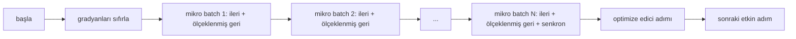
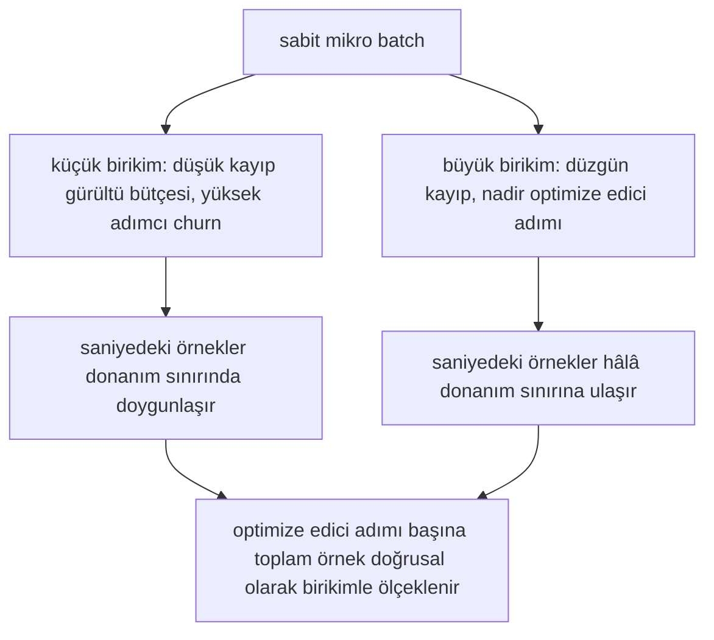

> **Orijinal İçerik:** [docs/en.md](https://github.com/rohitg00/ai-engineering-from-scratch/blob/main/phases/19-capstone-projects/46-gradient-accumulation/docs/en.md)

# Gradyan Birikimi

> Karşılayamadığınız etkin bir batch'te, bir kerede bir mikro-batch ile eğitin. Kaybı ölçekleyin, optimize edici adımını tutun ve gradyanların yığılmasına izin verin.

**Tür:** Uygulama
**Diller:** Python
**Ön Koşullar:** Faz 19 dersleri 42-45
**Süre:** ~90 dakika

## Öğrenme Hedefleri

- Etkin batch kimliğini türetmek: `effective_batch = micro_batch * accum_steps`.
- Kayıp-başına-mikro-batch ölçekleme uygulamak, böylece birikmiş gradyan tek bir tam batch geri geçişine eşleşir.
- Son mikro-batch'a kadar optimize edici senkronizasyonunu atlamak (son adımda senkronize et).
- Etkin batch'a karşı çıktıyı (throughput) okumak ve azalan verimi açıklamak.

## Sorun

Etkin bir 512 batch'inde eğitmek istiyorsunuz çünkü kayıp eğrisi daha düzgün ve optimize edici adımı o ölçekte daha anlamlı. Masanızdaki hızlandırıcı, belleği tükenmeden önce 32 örneği tutar. Batch'i ikiye katlamak bir seçenek değil. Modeli yarıya indirmek bir seçenek değil. Alanın 2017'de başvurduğu ve asla bırakmadığı hile, 16 geri geçişi çalıştırmak, gradyanların parametre arabelleklerinin içinde birikmesine izin vermek ve sayım hedefe ulaştığında yalnızca optimize ediciyi adımlamaktır.

Risk, kaybın artık büyük batch'teki aynı sayı olmamasıdır. 16 mini-batch'in saf olarak toplanan cross entropy'si, tek bir tam batch'in kaybının 16 katıdır. Ölçekleme olmadan, gradyan yönü doğrudur ancak büyüklük yanlıştır ve optimize edici adımı 16 kat fazla büyüktür. Düzeltme bir bölmedir. Düzeltme aynı zamanda unutulması kolaydır.

## Kavram



Sözleşme kısadır:

- `backward()`'dan önce her mikro-batch için kayıp `accum_steps`'e bölünür. PyTorch varsayılan olarak gradyanları `param.grad`'a toplar; bölme, çalışan toplamı doğru ölçeğe geri iter.
- Optimize edici adımı, etkin batch başına bir kez, son mikro-batch'in geri geçişinden sonra tetiklenir. Birikim ortasında adım atmak, çalıştırmanın geri kalanının dayandığı her parametreyi çarpıtır.
- Optimize edicinin durumu (momentum arabellekleri, Adam momentleri), mikro-batch başına değil, etkin adım başına bir kez ilerler. Üstel hareketli ortalamalar, aksi takdirde yanlış frekansı görür ve zamanlamayı yakar.
- Tek bir cihazda bu defter tutmadır. Çok sıralı bir kümede aynı örüntü, son olmayan mikro-batch'leri `no_sync` bağlamına sarar; bu, gradyan tüm-azaltımını (all-reduce) atlar; son mikro-batch, birikmiş tam gradyanı tek geçişte azaltır, ağ maliyetini N kez ödemek yerine.

### Kodda eşdeğerlik kanıtı

```python
loss = criterion(model(x_full), y_full)
loss.backward()
opt.step()
```

şuna eşdeğerdir:

```python
for x, y in chunks(x_full, y_full, n):
 scaled = criterion(model(x), y) / n
 scaled.backward()
opt.step()
```

kayan nokta toplama sırasına kadar. Döngünün sonundaki birikmiş gradyan arabelleği, tek bir tam batch geri geçişinin üreteceği aynı tensördür. Ders kodu bunu `equivalence_check` içinde 1e-4'ün altında bir max-abs farkıyla iddia eder.

### Maliyet nereye gider

Her mikro-batch, bir ileri ve bir geri geçişe mal olur. Birikimle bellek için zaman değiş tokuş edersiniz. `outputs/accum-curve.json` içindeki çıktı eğrisi, sabit mikro-batch'te etkin batch büyüdükçe ne olduğunu gösterir:



Bedava yemek yok. `accum_steps`'i ikiye katlamak, optimize edici adımı başına duvar zamanını ikiye katlar. Değişen, gradyan tahmininin varyansıdır: aynı duvar bütçesinde daha az optimize edici adımı yapmışsınızdır, ancak her biri daha fazla örnek üzerinden ortalanmıştır. Literatür, büyük batch ve küçük batch'i farklı optimizasyon problemleri olarak ele alır; buradaki ders mekaniktir, istatistiksel değil.

## İnşa Et

`code/main.py` çalıştırılabilir yapıttır. Üç şey yapar.

### Adım 1: eşdeğerlik kontrolü

`equivalence_check()`, aynı ağın aynı seed ile iki kopyasını kurar. Biri 16 örneklik bir batch'i tek bir ileri geçişte görür. Diğeri, kaybı dörde bölerek dört 4 örneklik parçayı görür. Fonksiyon, optimize edici adımından önce gradyan arabelleklerini ve sonra parametreleri karşılaştırır. İddia `max_abs_diff < 1e-4`'tür.

### Adım 2: son adımda senkronize et örüntüsü

`train_one_optimizer_step` mikro-batch'lerde yürür. Son mikro-batch dışında her biri için `no_sync_context(model)`'e girer. Tek süreçte bağlam bir no-op'tur; DDP'de gradyan tüm-azaltımının atlandığı yer burasıdır. Defter tutma, ne olursa olsun aynıdır. Bir `sync_counter`, no_sync kapsamından kaç kez çıktığımızı kaydeder; N mikro-batch için sayım, etkin adım başına birdir, N değil.

### Adım 3: çıktı eğrisi

`sweep_effective_batches` aynı modeli sabit bir mikro-batch ve bir birikim adımları listesiyle çalıştırır. Her ayar için loglar:

- `samples_per_sec`: toplam örneklerin duvar zamanına bölümü
- `median_step_ms`: etkin adım başına 50. yüzdelik
- `sync_calls`: çalıştırılan toplu noktalar
- `avg_loss`: taramanın optimize edici adımları boyunca ortalama

Çıktı `outputs/accum-curve.json`'a iner ve bir defterden yeniden kullanılabilir.

Çalıştırın:

```bash
python3 code/main.py
```

Betik eşdeğerlik farkını, sonra tarama tablosunu, sonra JSON yolunu yazdırır. Çıkış kodu sıfır.

## Kullan

Üretim eğitiminde, gradyan birikimi tek bir düğmenin arkasında yaşar. PyTorch'un örüntüsü `accumulation_steps = effective_batch // (micro_batch * world_size)`'tir. Burada kullanmanıza izin verilmeyen çerçeveler aynı döngüyü sarar, ancak adımlar aynıdır: kaybı ölçekleyin, son olmayan mikrolarda senkronizasyonu atlayın, biriktirin, bir kez adımlayın.

Vahşi doğada üç örüntü:

- Mikro-batch boyutu, cihaz belleğini doyuracak şekilde seçilir. Daha küçük her şey hızlandırıcı döngülerini boşa harcar. Daha büyük çöker.
- Etkin batch, bir öğrenme oranı zamanlamasından seçilir. Büyük etkin batch'lerin ölçeklenmiş öğrenme oranlarına ve ısınmaya ihtiyacı vardır; bu, 2017'den beri konuşulan doğrusal ölçekleme kuralıdır.
- Birikim sayımı, ikisi arasındaki köprüdür ve veri yükleyiciyi yeniden yazmadan çalışma zamanında ayarlamakta serbest olduğunuz tek düğmedir.

## Gönder

`outputs/skill-gradient-accumulation.md` reçeteyi yakalar, böylece bir meslektaş onu yeni bir depoya bırakabilir: kaybı `accum_steps`'e göre ölçekleyin, son olmayan mikrolarda optimize edici senkronizasyonunu atlayın, etkin batch başına optimize ediciyi bir kez adımlayın, ödünleşimi görünür kılmak için etkin batch'a karşı çıktıyı JSON olarak loglayın.

## Alıştırmalar

1. Taramayı `--num-steps 100` ile yeniden çalıştırın ve saniyedeki örnekleri etkin batch'a karşı çizin. Eğri nerede düzleşir?
2. Yanlış ölçekleme varyantı (bölme yok) ekleyin ve adım 1'de referansa karşı parametre farkını gösterin.
3. SGD'yi AdamW ile değiştirin ve optimize edici durumunun mikro-batch başına değil, etkin adım başına bir kez ilerlediğini doğrulayın.
4. Gerçek bir `DistributedDataParallel` sarmalayıcısı tanıtın ve `no_sync_context`'i onun yöntemine yönlendirin. sync_calls'ın etkin batch başına N-1 düştüğünü doğrulayın.
5. Eşdeğerlik kontrolünü, farklı mikro bölünmeleri (2'ye 8 ve 4'e 4) karşılaştıracak şekilde değiştirin ve gevşetmeniz gereken herhangi bir toleransı açıklayın.

## Temel Terimler

| Terim | İnsanların söylediği | Gerçekte ne anlama geldiği |
|-------|---------------------|--------------------------|
| Mikro batch | "İlediğiniz batch" | Tek bir ileri geçişte belleğe sığan dilim |
| Birikim adımları | "Adım başına geri geçişler" | Bir optimize edici adımından önce toplanan geri geçiş sayısı |
| Etkin batch | "Batch" | Mikro batch çarpı birikim adımları çarpı veri paralel dünya boyutu |
| Kayıp ölçekleme | "N'ye böl" | Toplanan gradyanların tam batch ile eşleşmesi için mikro-batch başına bölme |
| Son adımda senkron | "Geri kalanını atla" | Yalnızca penceredeki son geri geçişte gradyan kolektifini çalıştır |

## İleri Okuma

- Üretim sürümü için `DistributedDataParallel.no_sync` üzerine PyTorch belgeleri.
- Goyal ve ark., 2017, büyük batch eğitimi için doğrusal ölçekleme üzerine, etkin batch ile ilgilenmenin kanonik nedeni.
- Karışık hassasiyet ölçek kaldırma ile gradyan birikimi etkileşimleri üzerine PyTorch sorun izleyici.
- Faz 19 dersleri 42-45, modeli, veri yükleyiciyi, optimize ediciyi ve eğitici iskelesini kapsar; bu ders onları varsayar.
- Faz 19 ders 47, uzun bir birikim çalıştırmasının bir duvar saati sınırından sağ çıkması için kontrol noktası ve sürdürmeyi kapsar.
