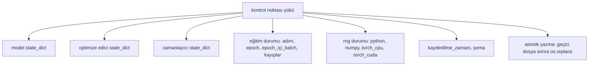
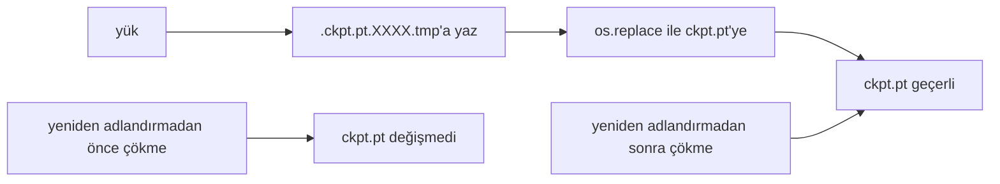
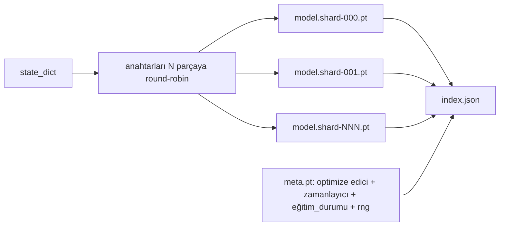

> **Orijinal İçerik:** [docs/en.md](https://github.com/rohitg00/ai-engineering-from-scratch/blob/main/phases/19-capstone-projects/47-checkpoint-save-resume/docs/en.md)

# Kontrol Noktası Kaydetme ve Sürdürme

> Eğitim kesintileri çalıştırmaları öldürür; kontrol noktaları onların devam etmesini sağlar. Modeli, optimize ediciyi, zamanlayıcıyı, kayıp geçmişini, adım sayacını ve RNG durumunu atomik olarak kaydedin, böylece herhangi bir anda bir öldürme, disk üzerinde geçerli bir dosya bırakır.

**Tür:** Uygulama
**Diller:** Python
**Ön Koşullar:** Faz 19 dersleri 42-45
**Süre:** ~90 dakika

## Öğrenme Hedefleri

- Tam eğitim durumunu, taze bir sürece yeniden yüklenebilen tek bir yüke (payload) yakalayın.
- Yazma-sırasında-çökme hiçbir zaman yarı yazılmış bir dosya bırakmaması için geçici dosyaya yazma-ardından-yeniden-adlandırma ile atomik kayıt uygulayın.
- Sürdürme sonrası kaybın kesintisiz taban çizgisiyle eşleşmesi için Python, NumPy ve PyTorch için RNG durumunu geri yükleyin.
- Tek bir dosyaya sığmayan modeller için parçalı kontrol noktası düzeni kurun, hash ile doğrulanmış parçalarla ve bir JSON diziniyle.

## Sorun

Bir eğitim işini 18 saat için ayarladınız. Duvar saati sınırı 4 saattir. Küme, maaşınızın üstünde biri çekirdek yükseltmesini onayladığı için 11. saatte yeniden başlar. Kontrol noktaları olmadan sıfırdan başlarsınız. Sürdürme olmadan, ilk 11 saatin öğrenmek için aldığı optimize edici durumunu da kaybedersiniz; bu nedenle, model ağırlıkları hayatta kalmış olsa bile, AdamW momentleri gider ve bir sonraki adım, eğitim yörüngesinin zaten geçtiği bir yönde sendeler.

Doğru yapıt, devam etmek için gereken her şeyi tutan tek bir dosyadır: model parametreleri, optimize edici durumu, zamanlayıcı durumu, çizimler için kayıp geçmişi, mevcut adım ve epoch ve epoch-içi-batch sayaçları ve her rastgelelik kaynağı için RNG durumu. RNG durumu olmadan, sürdürülen kayıp eğrisi farklı bir eğridir. Aynı model, aynı veri, farklı karıştırma, farklı dropout maskesi, panoda farklı sayı.

Atomik kayıt, sözleşmenin diğer yarısıdır. Son dosya adına yazmak, yazma ortasında bir çökmenin bozuk bir dosya bırakması anlamına gelir; sürdürme çöp okur. Aynı dizinde geçici bir dosyaya yazmak ve sonra yeniden adlandırmak, yazma ortasında bir çökmenin önceki iyi dosyaya dokunulmamış şekilde bırakması anlamına gelir. Yeniden adlandırma, POSIX dosya sistemlerinde atomiktir.

## Kavram



### Beş durum kovası

| Kova | Neden önemli |
|------|--------------|
| Model | Ağırlıklar ve arabellekler; modelin ne olduğu. |
| Optimize edici | Momentum ve uyarlanabilir momentler; bunlar olmadan bir sonraki adım farklı bir optimizasyon problemidir. |
| Zamanlayıcı | Öğrenme oranının eğrisinde nerede olduğu; özellikle kosinüs zamanlamaları umursar. |
| Eğitim sayaçları | Adım, epoch, epoch-içi-batch, artı panoyu çizen kayıp geçmişi. |
| RNG durumu | Dropout, veri karıştırma ve model içindeki herhangi bir örnekleme için determinizm. |

### Atomik kayıt



İki kural. Birincisi, geçici dosya hedefle aynı dizinde yaşar, böylece yeniden adlandırma aynı dosya sistemi içinde kalır; cihazlar arası yeniden adlandırmalar atomik değildir. İkincisi, geçici ad deneme başına benzersizdir, böylece iki yazar birbirini eşelemez.

### Parçalı kontrol noktaları

Model büyüdüğünde tek-dosya yükü, hızlı yüklemek için çok büyük, incelemek için çok büyük ve bir ağ paylaşımı okuma ortasında hıçkırıdığında çok acı verici hale gelir. Düzeltme, parametre durumunu parçalara bölmek ve onları birbirine bağlayan küçük bir dizin yazmaktır.



Dizin, parça sayısını, her parçanın sha256'sını ve meta dosyasının sha256'sını kaydeder. Yükleyici, herhangi bir hash uyuşmazlığında yüksek sesle başarısız olur. Parçalar farklı fiziksel disklere inebilir; meta küçüktür ve önce okunur.

### Sürdürme epoch ortasında devam eder

Sonraki epoch'un başına atlayan bir sürdürme, dakikalardan güne kadar boşa harcar. Düzeltme, `(epoch, batch_in_epoch)` artı RNG durumudur. Yüklemeden sonra eğitim döngüsü, rastgele sayı üretecini mevcut epoch'ta zaten tüketilmiş batch'lerin ötesine hızlı ileri sarar ve `batch_in_epoch`'tan devam eder. Ders kodu tam olarak bunu yapar; iddia, sürdürmeden sonraki kayıp yörüngesinin kesintisiz taban çizgisiyle 1e-4 içinde eşleşmesidir.

## İnşa Et

`code/main.py` dört temel yapı ve bir demo sürücüsü sağlar.

### Adım 1: RNG durumunu yakala ve geri yükle

`capture_rng_state`, Python'un `random.getstate`'i, NumPy'nin `np.random.get_state`'i ve PyTorch CPU ve CUDA RNG byte'ları ile bir dict döndürür. `restore_rng_state` onu tersine çevirir. CPU tensörü, PyTorch'un RNG'sinin tüketmeyi bildiği bir uint8 byte arabelleğidir.

### Adım 2: atomik kayıt

`atomic_save`, yükü hedef dizinde geçici bir dosyaya yazar, sonra `os.replace` onu son adla değiştirir. `atomic_write_json`, parçalı dizin için aynısını yapar.

### Adım 3: tam kontrol noktası gidiş-dönüşü

`save_checkpoint`, modeli, optimize ediciyi, zamanlayıcıyı, eğitim durumunu ve RNG'yi tek bir dict'e paketler. `load_checkpoint` onu tersine çevirir ve bir `TrainState` döndürür. Şema alanı yükseltme kancasıdır: gelecekteki format değişiklikleri sürüm dizesini yükseltir ve yükleyici yönlendirir.

### Adım 4: parçalı varyant

`save_sharded_checkpoint`, parametre anahtarlarını round-robin ile N parçaya böler, her parçayı kendi atomik kaydıyla yazar, meta dosyasına optimize edici ve zamanlayıcı ve eğitim durumunu yazar ve JSON dizinini parça sha256'larıyla yazar. `load_sharded_checkpoint`, birleştirmeden önce her parçayı doğrular.

### Adım 5: sürdürme demosu

`run_resume_demo`, küçük bir modeli `total_steps` için eğitir, `interrupt_at`'te bir kontrol noktası kaydeder, sonra devam eder. İkili bir süreç kontrol noktasını geri yükler ve kalan adımları çalıştırır. Fonksiyon, kesinti noktasından sonra iki kayıp yörüngesi arasındaki maksimum mutlak farkı döndürür. RNG geri yüklendiğinde, fark sıfır veya kayan nokta gürültüsüdür.

Çalıştırın:

```bash
python3 code/main.py
```

Tek-dosya ve parçalı demoların ikisi de 1e-4'ün altında max-diff iddia eder. Özet `outputs/resume-demo.json`'a iner.

## Kullan

Üretim eğitim yığınları, kontrol noktalamayı eğiticinin bir parçası olarak gönderir. Şekil aynıdır: model + optimize edici + zamanlayıcı + sayaçlar + RNG, atomik olarak yazılmış, adımla adlandırılmış, böylece en sonuncunu bulmak kolay. Parçalı düzenler, paralel okumalarla büyük model yüklemeyi güçlendirir; bunu çalıştıran index.json'dur.

Uygulanacak üç örüntü:

- **Şema, yükteki bir dizedir.** Geçişler onu dallandırır. Olmadan, eski çalıştırmaları kırmadan formatı geliştiremezsiniz.
- **Her parçayı sha256'layın.** Sessizce kesilen bir indirme, en kötü hata türüdür; yükleyici hızlı başarısız olur veya geç başarısız olur.
- **Kontrol noktası sıklığını dürüst tutun.** N adımda ve her duvar saati dakikasında, hangisi daha kısaysa kaydedin. Aksi takdirde, çöken uzun adım, çalışmanın tam bir penceresini boşa harcar.

## Gönder

`outputs/skill-checkpoint-save-resume.md`, herhangi bir yeni eğitim betiği için reçetedir: yük şekli, atomik yazma, RNG yakalama, parçalı dizin. Beceriyi bir depoya bırakın, periyodik kayıt yerinde `save_checkpoint`'ı bağlayın, başlangıçta `load_checkpoint`'ı bağlayın ve çalıştırma öldürmelerden sağ çıkar.

## Alıştırmalar

1. Round-robin parçalamayı parametre grubuna göre parçalamayla değiştirin (`.weight` ile biten katmanlar ve `.bias` ile bitenler). Her düzen ne zaman tercih edilir?
2. Kayıt döngüsünü, son K kontrol noktasını tutacak ve eskilerini budayacak şekilde genişletin. Disk küçük olduğunda doğru K nedir?
3. Adım sayımı yerine bir duvar saati aralığında kayıt tetikleyen bir `--ckpt-every-seconds` bayrağı ekleyin.
4. Başlangıçta çalışan, dizindeki her kontrol noktasını tarayan ve hangilerinin bozuk olduğunu raporlayan bir sağlama toplamı doğrulama yolu ekleyin.
5. Yüke yeni bir alan ekleyen ve şema dizesini yükselten bir `migrate_v1_to_v2` fonksiyonu uygulayın. Yüklemenin her iki sürümü de tolere etmesini sağlayın.

## Temel Terimler

| Terim | İnsanların söylediği | Gerçekte ne anlama geldiği |
|-------|---------------------|--------------------------|
| Atomik kayıt | "Yaz ve dua et" | Aynı dizinde geçici bir dosyaya yazın, sonra os.replace ile hedef ada |
| State dict | "Ağırlıklar" | Parametre adıyla anahtarlanan model parametreleri ve arabellekleri |
| Parçalı kontrol noktası | "Büyük model dosyası" | Parça başına birden çok dosya, artı bir meta dosyası ve sha256'ları içeren bir JSON dizini |
| RNG durumu | "Rastgele seed" | Python random, numpy, torch CPU, torch CUDA için yakalanan durum; yalnızca seed değil |
| Epoch ortası sürdürme | "Yeniden başlatma" | RNG'yi hızlı ileri sarın ve aynı epoch'taki bir sonraki batch'tan devam edin |

## İleri Okuma

- `os.replace`'in dayandığı atomiklik iddiası için POSIX `rename` semantiği.
- `map_location` dahil `torch.save` ve `torch.load` üzerine PyTorch belgeleri, cihazlar arası geri yüklemeler için.
- Faz 19 ders 46, bu dersin kontrol noktası yükünün içinden sağ çıktığı gradyan birikimini kapsar.
- Faz 19 ders 48, bu şemanın karşıladığı dağıtılmış sarmalayıcıların state dict formatını kapsar.
- Atomik yeniden adlandırmanın arkasındaki dayanıklılık garantisi için Linux çekirdeği `fsync` belgeleri.
