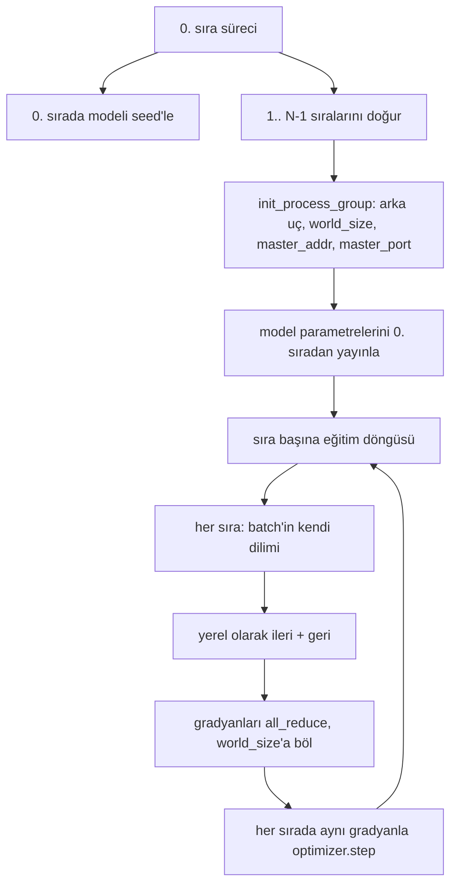
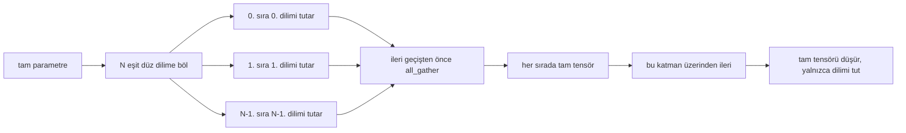

> **Orijinal İçerik:** [docs/en.md](https://github.com/rohitg00/ai-engineering-from-scratch/blob/main/phases/19-capstone-projects/48-distributed-fsdp-ddp/docs/en.md)

# Sıfırdan Dağıtılmış Veri Paraleli ve FSDP

> Çok sıralı eğitim, iki kolektif ve bir kuraldır. Başlangıçta parametreleri yayınlayın, geri geçişten sonra gradyanları ortalayın, sıraların hangi adımda oldukları konusunda asla anlaşmazlık etmelerine izin vermeyin.

**Tür:** Uygulama
**Diller:** Python
**Ön Koşullar:** Faz 19 dersleri 42-45
**Süre:** ~90 dakika

## Öğrenme Hedefleri

- N sıra üzerinden `gloo` arka ucuyla, özel donanım olmadan bir süreç grubu kurun.
- Yapımda parametreleri yayınlayan ve geri geçişten sonra gradyanları tüm-azaltan (all-reduce) minimal bir DDP sarmalayıcısı uygulayın.
- Sıra başına gradyanların tüm-azaltımının, birleştirilmiş giriş üzerinde tek-süreç gradyanıyla eşleştiğini kanıtlayın.
- FSDP parametre parçalamasını eskiz halinde çizin: her sıra bir dilim tutar, tam tensör ileri geçiş için toplanır ve sonra düşürülür.

## Sorun

Model tek bir cihaza sığar. Veri kümesi sığmaz. Optimizasyon bütçesi, duvar saati saniyesi başına N kat daha fazla örnek görmek istediğinizi söylüyor. İlk kol, veri paralelidir: her sıra aynı modeli batch'in farklı bir diliminde çalıştırır, sonra optimize edici adımından önce gradyanları ortalar. İkinci kol, FSDP'dir: model tek bir cihaza da sığmaz, dolayısıyla her sıra her parametrenin bir kesrini tutar ve ileri geçiş sırasında tam tensörleri katman katman yeniden oluşturur.

Acı, defter tutmadır. Parametreler sıralar arasında sürüklenirse, çalıştırma sessizce bozuktur. Gradyanları ama kaybı ortalamazsanız, pano yalan söyler. Kolektif arka uç bir topoloji üzerinde anlaşamazsa, çalıştırma sonsuza kadar asılır. Düzeltme, kolektifleri bir kez elle yazmak ve asla yeniden üretemeyeceğiniz bir sarmalayıcıya güvenmemektir.

Bu ders CPU'da çalışır. CUDA varsayılmaz. `gloo` arka ucu her PyTorch derlemesiyle gelir ve `torch.multiprocessing` işçilerini kabul eder; aynı kod, yapıyı değiştirmeden çok-GPU düğümde `nccl`'ye geçer.

## Kavram



### Önemli olan iki kolektif

| Kolektif | Ne yapar | Ne zaman |
|----------|----------|----------|
| `broadcast` | Bir tensörü bir sıradan diğerlerine kopyalar | Parametre başlatma, zamanlayıcı durumu, herhangi bir birden çoğa senkronizasyon |
| `all_reduce` | Tüm sıralar boyunca bir tensörü toplar (veya ortalama veya maksimum), her sıra sonucu alır | Geri geçişten sonra gradyan ortalaması |
| `all_gather` | Her sıra bir tensör katkıda bulunur, her sıra birleştirmeyi alır | Logit toplama, FSDP parametre unşardı |

DDP sözleşmesi, yapımda `broadcast` ve geri geçişten sonra `all_reduce`'dır. FSDP eskizi, her katmanın ileri geçişinden önce `all_gather` ekler.

### Gradyan ortalaması, tek-süreç gradyanıyla eşleşir

N sıra üzerinden B örneklik bir batch üzerinde eğitilmiş bir model, N*B üzerinde tek bir süreçle eğitilmişle aynı gradyanı üretmelidir. Hile, sıra başına gradyanları toplamak ve N'e bölmenin, tam batch üzerinde ortalama azaltma ile çapraz entropinin üreteceği ortalama kayıp gradyanını vermesidir. Ders kodu, manuel all-reduce gradyanı ile referans tek-süreç gradyanı arasında `max-abs-diff < 1e-3` iddia eder.

### FSDP eskizi



Bellek kazancı kesindir: parametreler için sıra başına bellek 1/N'e düşer. Maliyet toplama işlemidir, bu da her ileri geçişte ödenir. Üretim FSDP'si, toplamayı önceki katmanın hesaplamasıyla örtüştürür, böylece duvar saati maliyeti naif muhasebenin öngördüğünden çok daha küçüktür. Ders, her parametrede gidiş-dönüşü yapar ve yeniden oluşturmanın orijinaline bit-eşit olduğunu iddia eder.

### CPU ve gloo arka ucu

CUDA üretim hedefidir, ancak aynı kod yolları CPU'da da vardır. `gloo`, CPU kolektif arka ucudur. GPU'larda `nccl`'den mertebe mertebe daha yavaştır, ancak API yüzeyi aynıdır. Dersin süreç grubu `backend="gloo"` ile başlatılır ve sıralar `torchrun` yerine `torch.multiprocessing` ile doğurulur; her ikisi de aynı `torch.distributed` çağrılarında biter. Çok-GPU düğümde, tek değişiklikler `backend="nccl"`, cihaz tensörleri ve başlatmak için `torchrun`'dur.

## İnşa Et

`code/main.py` çalıştırılabilir yapıttır.

### Adım 1: süreç grubunu kur

```python
os.environ["MASTER_ADDR"] = "127.0.0.1"
os.environ["MASTER_PORT"] = str(port)
dist.init_process_group(backend="gloo", rank=rank, world_size=world_size)
```

`MASTER_ADDR` ve `MASTER_PORT` buluşma noktasıdır: her sıra aynı ana bilgisayardaki aynı portu çevirir. Ders, birkaç çalıştırma bir makineyi paylaştığında çarpışmaları önlemek için bind-and-close hilesiyle boş bir port seçer.

### Adım 2: yapımda yayınla

`MinimalDDP.__init__`, her parametreyi ve arabelleği yürür ve `dist.broadcast(tensor, src=0)` çağırır. 0. sıranın değerleri kanonik başlatma olur. Bu olmadan, her sıra kendi seed'iyle başlatır ve sıralar bir adımdan itibaren ıraksar.

### Adım 3: geri geçişten sonra all-reduce gradyanlar

```python
def all_reduce_grads_(module, world_size):
 for p in module.parameters():
 if p.grad is None:
 p.grad = torch.zeros_like(p.data)
 dist.all_reduce(p.grad.data, op=dist. ReduceOp. SUM)
 p.grad.data.div_(world_size)
```

Her sıra aynı ortalaması alınmış gradyanla biter. Optimize edici adımı artık her sırada aynı girişin bir fonksiyonudur; bu, parametrelerin çalıştırma boyunca senkronize kalmasının nedenidir.

### Adım 4: eşdeğerliği kanıtla

`manual_all_reduce_matches_single_process`, 0. sırada aynı modeli kurar ve all-reduce sonrası gradyanı, tek bir sürecin birleştirilmiş giriş üzerinde hesaplayacağı gradyanla karşılaştırır. max-abs-diff yaklaşık 1e-8'dir.

### Adım 5: FSDP gidiş-dönüşü

`fsdp_round_trip_sketch`, her parametreyi düzleştirir, `world_size`'ın katına kadar padler, dilimler, all-gather yapar ve unpadler. Her sıranın yeniden oluşturması orijinale eşittir. Bu unşard adımıdır; tersi (ileri geçişten sonra yeniden parçala), toplanan tensörden bir dilim kesmektir.

Çalıştırın:

```bash
python3 code/main.py
```

Varsayılan dünya boyutu 2'dir. İki CPU süreci doğar, `gloo` üzerinden konuşur ve sıfırla çıkar. Çıktı `outputs/ddp-demo.json`, sıra başına parametre toplamlarını, all-reduce sonrası gradyan normunu, FSDP gidiş-dönüşü sonucunu ve manuel-vs-referans gradyan farkını yakalar.

## Kullan

Üretim eğitim yığınları aynı temelleri çağırır. PyTorch'un `DistributedDataParallel`'ı şunları ekler: all-reduce'u geri geçişle örtüştüren geri geçiş sonrası gradyan kancaları, birkaç küçük gradyanı tek bir kolektifte birleştiren bucketed all-reduce ve ders 46'nın kullandığı `no_sync` bağlamı.

PyTorch'un FSDP'si şunları ekler: her sıranın bir bitişik arabellek tutması için katman başına düz parametre görünümü, bir sonraki katmanın unşardının mevcut katmanın hesaplamasıyla örtüşmesi ve parçalar için isteğe bağlı CPU çıkışı.

Şekil aynı kalır: başlangıçta yayınla, geri geçişten sonra azalt, artık sığmadıklarında parametreleri parçala.

## Gönder

`outputs/skill-distributed-fsdp-ddp.md`, yeni bir eğitim betiği için reçeteyi taşır: CPU için `gloo` ve GPU için `nccl` ile süreç grubunu kurun, modeli yapımda yayınlayan ve geri geçişten sonra azaltan bir DDP kabuğu içine sarın, isteğe bağlı olarak parametreleri FSDP eskizinden all_gather örüntüsüyle parçalayın.

## Alıştırmalar

1. `--world-size 4` ile çalıştırın ve param yayılımının çalıştırma boyunca 1e-3'ün altında kaldığını doğrulayın.
2. Manuel ortalamayı `dist.all_reduce(op=dist. ReduceOp. AVG)` ile değiştirin ve zaman farkını ölçün.
3. DDP sarmalayıcısına bir geri geçiş sonrası kanca ekleyin, böylece all-reduce geri geçişin geri kalanıyla örtüşür; duvar saati iyileşmesini ölçün.
4. FSDP yeniden parçalama adımını uygulayın: ileri geçişten sonra, tam tensörü yine yerel parçayla değiştirin. Sıra başına belleğin düştüğünü doğrulayın.
5. Arka ucu bir CUDA kutusunda `nccl`'ye geçirin. Hangi ortam değişkenlerinin değiştiğini ve hangilerinin aynı kaldığını not edin.

## Temel Terimler

| Terim | İnsanların söylediği | Gerçekte ne anlama geldiği |
|-------|---------------------|--------------------------|
| Arka uç | "gloo veya nccl" | Kolektif işlemleri uygulayan kütüphane; gloo CPU, nccl GPU |
| Dünya boyutu | "Toplam sıralar" | Gruptaki süreç sayısı; grup, kolektiflerin üzerinde çalıştığı birimdir |
| Sıra | "İşçi kimliği" | Grup içinde sıfır indeksli süreç tanımlayıcısı |
| Tüm-azaltım | "Gradları topla" | Tüm sıralar boyunca bir tensörü topla, her sıra aynı sonuçla biter |
| Unşard | "Paramları topla" | all_gather aracılığıyla sıra başına dilimlerden tam tensörü yeniden oluştur |

## İleri Okuma

- Bu dersin dayandığı kolektif semantik için PyTorch `torch.distributed` belgeleri.
- `gloo` kütüphanesinin kolektif listesi, CUDA destekli `nccl` temelleriyle şekil olarak aynı.
- DDP all-reduce'unu `no_sync` içinde saran gradyan birikim örüntüsü için Faz 19 ders 46.
- DDP ve FSDP çalıştırmalarından sağ çıkan kontrol noktası düzeni için Faz 19 ders 47.
- Burada eskiz halinde çizilen parametre parçalamanın üretim uygulaması için PyTorch FSDP belgeleri.
