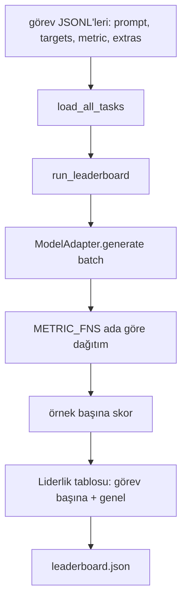
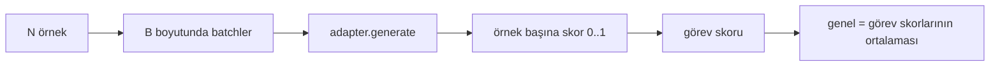

> **Orijinal İçerik:** [docs/en.md](https://github.com/rohitg00/ai-engineering-from-scratch/blob/main/phases/19-capstone-projects/49-lm-eval-harness/docs/en.md)

# Dil Modeli Değerlendirme Demeti

> Tanımlayamadığınız bir görevde iyi yapan bir model, tesadüfen iyi yapan bir modeldir. Demet, görev tanımı, metrik, çalıştırıcı ve liderlik tablosudur; kısa, değiştirilebilir tek bir şekilde.

**Tür:** Uygulama
**Diller:** Python
**Ön Koşullar:** Faz 19 dersleri 42-45
**Süre:** ~90 dakika

## Öğrenme Hedefleri

- Bir görevi, örnek başına `prompt`, `targets`, `metric` ve isteğe bağlı `extras` ile bir JSONL dosyası olarak tanımlayın.
- Beş metrik uygulayın: tam eşleşme (exact match), rouge-l F1, çalıştırılabilir kontrol, çoktan seçmeli ve alt dize içerir.
- Görev başına örnekleri batchleyen ve değiştirilebilir bir model adaptörüne yönlendiren bir çalıştırıcı kurun.
- Görev başına skorları, gecikmeyi ve tekrarlanabilir bir genel ortalamayı içeren bir liderlik tablosu JSON'ı yayınlayın.

## Sorun

Her hafta yeni bir dil modeli gelir. Pazarlama iddiası, iyi yaptığıdır. Dürüst soru, neyde iyi? Dürüst yanıt, kendi yazdığınız liderlik tablosudur, çünkü satıcının liderlik tablosu, ince ayar yaptığı tablodur.

Deponuzda bir demet olmadan, iki modeli sezgiyle karşılaştırırsınız. Bir demetle, onları sabit bir görev kümesinde sabit bir metrikle, diff yapabileceğiniz bir JSON çıktısı üzerinde skorla karşılaştırırsınız. Demet, dünün çalıştırması ile bugünün çalıştırması arasındaki sözleşmedir. Olmadan, gerilemeler gönderilir.

Tuzak, demeti tek bir modele aşırı uydurmaktır. Düzeltme, aynı tuzağın tersidir: demet on beş dakikada okunacak kadar küçüktür, görevler depoda gönderilecek kadar küçüktür, metrikler sıfırdan yazılmıştır, böylece bir meslektaş denetleyebilir ve adaptör, modele özgü kodun yaşadığı tek yerdir. Adaptörü değiştirin, liderlik tablosu hareket eder; görevleri değiştirin, liderlik tablosu hareket eder. Başka hiçbir şey hareket etmemelidir.

## Kavram



### Görev belirtimi

Her örnek bir JSONL satırıdır:

```json
{"id": "arith-00", "prompt": "compute: 2 + 2", "targets": ["4"], "metric": "exact_match"}
```

Puanlama yardımcıları gerektiren metrikler için `extras` yan yükü taşır:

```json
{
 "id": "code-00",
 "prompt": "python: write a function f that doubles its input",
 "targets": ["ok"],
 "metric": "code_exec",
 "extras": {"io_pairs": [[1, 2], [3, 6]]}
}
```

Bir görev, `outputs/tasks/` altında bir `.jsonl` dosyasıdır. Dosya adı, görevin adıdır. Bir dosyadaki tüm örnekler bir metrik paylaşır.

### Beş fixture görevi

| Görev | Metrik | Neyi test eder |
|-------|--------|---------------|
| arithmetic | exact_match | Deterministik bir yanıt üzerinde token düzeyinde doğruluk |
| summary | rouge_l | Tek satırlık referans özete karşı en uzun ortak altdizi F1 |
| code-exec | code_exec | Çalıştırılabilir test: tahmin edilen fonksiyon bir girdi-çıktı çifti listesini karşılamalıdır |
| multiple-choice | multiple_choice | Tahminin ilk harfi izin verilen bir harfle eşleşmelidir |
| generation | substring_contains | Serbest biçimli metin en az bir hedef alt dize içermelidir |

### Metrik sözleşmesi

Her metrik, `(prediction, targets, extras) -> float in [0.0, 1.0]` fonksiyonudur. Demet, görev skorunu elde etmek için örnek başına skorları ortalar, sonra geneli elde etmek için görev skorlarını ortalar. Metrik fonksiyonları küçüktür:

- `exact_match`: küçük harf, boşlukları daralt, eşitlik.
- `substring_contains`: aynı normalizasyon, alt dize testi.
- `multiple_choice`: ilk karakter büyük harf.
- `rouge_l`: tahmin ve referans uzunluklarına bölünen LCS uzunluğu, precision ve recall'ın F1'i.
- `code_exec`: tahmini kısıtlı bir ad alanında çalıştırın, her girdi-çıktı çiftinde `f(x)` çağırın, eşleşmeleri sayın.

`code_exec` metriği, tahmini soyulmuş bir yerleşik ad alanında çalıştırır. Dersin testi, `import os`'un ad alanında olmadığı için patladığını iddia eder; bir kod tahmininden dosya sistemine ulaşamazsınız.

### Model adaptörü

```python
class ModelAdapter(Protocol):
 def generate(self, prompts: Sequence[str]) -> List[str]: ...
 @property
 def name(self) -> str: ...
```

Adaptör dikiştir. Ders, beş fixture görevindeki her prompt için doğru yanıtı döndüren deterministik bir kalıp eşleştirici olan `ToyAdapter`'ı gönderir. Gerçek bir adaptör modeli çağırır ve çıktısını döndürür. Demet hangisi olduğunu umursamaz.

### Çalıştırıcı

`run_task`, `batch_size` promptunu bir seferde batchler ve metrik fonksiyonuna yönlendirir. `run_leaderboard`, her görevde yürür ve ortalar. `write_leaderboard`, gelecekteki format değişikliklerinin panoları sessizce kırmaması için bir şema dizesiyle JSON yayar.



## İnşa Et

`code/main.py` çalıştırılabilir yapıttır.

### Adım 1: fixture görevlerini seed'le

`seed_fixture_tasks(target_dir)` beş `.jsonl` dosyasını yazar. `main.py`'nin ilk çalıştırması, dizin boşken onları seed'ler.

### Adım 2: görevleri yükle

`load_all_tasks(task_dir)` her `.jsonl`'yi okur ve görev adından `Example` kayıtları listesine bir dict döndürür. `#` ile başlayan yorum satırları ve boş satırlar atlanır, böylece katkıda bulunanlar dosyaları açıklayabilir.

### Adım 3: metrikleri uygula

Her metrik, bir birim testi olan küçük bir fonksiyondur. Dersin test paketi, normalizasyon, kısmi örtüşme, kod yürütme ve güvensiz kod reddi kapsayan 13 durum içerir.

### Adım 4: çalıştırıcıyı yaz

`run_task`, batchler üzerinde yinelenir ve `TaskResult`'ı skor, doğru sayım, toplam sayım ve gecikme ile üretir. `run_leaderboard`, tüm görevlerde yürür ve genel ortalamayla bir `Leaderboard` üretir.

### Adım 5: JSON yayınla

`write_leaderboard` panoyu serileştirir. `--include-per-example` bayrağı, skorlar hareket ettiğinde tahminleri önceki çalıştırmaya karşı diff yapabilmeniz için örnek başına kayıtları döker.

Çalıştırın:

```bash
python3 code/main.py
```

Betik, ilk çalıştırmada fixture'ları seed'ler, onları oyuncak adaptörle puanlar (her fixture'ı doğru alır) ve `outputs/leaderboard.json`'u yazar. Oyuncak adaptörle genel skor 1.0'dır; `test_main.py` içindeki stub adaptör testi, adaptör yanıtlayamadığında aynı demetin 0.0 ürettiğini gösterir.

## Kullan

Gerçek bir modeli takmak için bir adaptör yazın. Şekil:

```python
class HttpAdapter:
 name = "vendor.v1"

 def __init__(self, endpoint, api_key):
 self.endpoint = endpoint
 self.api_key = api_key

 def generate(self, prompts):
 out = []
 for prompt in prompts:
 response = http_post(self.endpoint, prompt, self.api_key)
 out.append(response["text"])
 return out
```

`main()`'in başında `ToyAdapter`'ı `HttpAdapter` ile değiştirin. Demet, görevler, metrikler ve liderlik tablosu aynı kalır.

Demeti gerçek bir projede gönderirken uygulanacak üç örüntü:

- **Görev dosyalarını sabitleyin.** `leaderboard.json`, hash sabitli görev içeriği taşır veya JSONL'leri yanında taşır; aksi takdirde görev dosyası değiştiğinde skor hareket eder ve hangisinin değiştiğini söyleyemezsiniz.
- **Sadece skorları değil, tahminleri diff yapın.** `--include-per-example` bayrağı, skorun düştüğü gün modelin ne dediğini görmenizi sağlar.
- **Batch boyutunu sınırlayın.** Gerçek adaptörlerin hız sınırları vardır. Küçük bir batch boyutu, demetin satıcılar arasında uyumlu kalmasını sağlar.

## Gönder

`outputs/skill-lm-eval-harness.md` reçeteyi taşır: JSONL görev belirtimi, beş metrik, değiştirilebilir adaptör, batchli çalıştırıcı, şema dizesiyle liderlik tablosu JSON'ı. `outputs/tasks/` içindeki görev dosyaları fixture'lardır; onları başlangıç olarak gerçek bir projeye kopyalayın.

## Alıştırmalar

1. Sıfırdan yazdığınız özel bir metrikle altıncı bir görev ekleyin (BLEU benzeri örtüşme, BLEURT benzeri referans puanlama, net bir sözleşmesi olan herhangi bir şey).
2. `code_exec`'i stdout'u yakalayacak ve hedef olarak beklenen stdout'ların bir listesini kabul edecek şekilde genişletin.
3. Bir liderlik tablosu diff komutu ekleyin: verilen iki `leaderboard.json` dosyası için, hangi görevlerin hareket ettiğini ve ne kadar hareket ettiğini yazdırın.
4. Örnek başına gecikmeyi sınırlayın. Adaptör çağrısını bir zaman aşımıyla sarın; liderlik tablosunda ayrı bir `timeouts` sütunu yüzeye çıkarın.
5. Gelecekteki bir okuyucunun aynı görevleri puanladığını doğrulayabilmesi için liderlik tablosunda bir sha256 ile görev içeriğini sabitleyin.

## Temel Terimler

| Terim | İnsanların söylediği | Gerçekte ne anlama geldiği |
|-------|---------------------|--------------------------|
| Görev belirtimi | "Değerlendirme formatı" | Örnek başına prompt, targets, metric ve isteğe bağlı extras içeren JSONL dosyası |
| Metrik | "Nasıl puanlarsın" | (prediction, targets, extras)'tan [0, 1] aralığında bir float'a fonksiyon |
| Adaptör | "Model istemcisi" | Bir generate(prompts) -> list[str] yöntemine sahip nesne; tek modele özgü kod |
| Liderlik tablosu | "Skor tablosu" | Görev başına skorlar, toplam sayımlar, gecikme ve genel ortalama içeren JSON |
| Kod çalıştırma metriği | "Çalıştır ve kontrol et" | Tahmini kısıtlı bir ad alanında çalıştırın, girdi-çıktı çiftlerine karşı karşılaştırın |

## İleri Okuma

- Çok daha büyük ama aynı şekilde orijinal lm-evaluation-harness için üretim referansı.
- Aynı sözleşmenin alternatif bir uygulaması için HuggingFace'in lighteval'i.
- Faz 19 ders 46, demetin puanladığı eğitim yığınında kullanılan gradyan birikim örüntülerini kapsar.
- Faz 19 ders 47, puanladığınız kontrol noktası formatını kapsar; kontrol noktası hash'ini liderlik tablosuna sabitleyin.
- Faz 19 ders 48, test edilen modeli üreten dağıtılmış eğitim yığınını kapsar.
