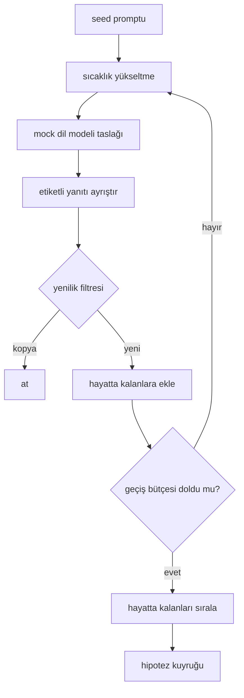

> **Orijinal İçerik:** [docs/en.md](https://github.com/rohitg00/ai-engineering-from-scratch/blob/main/phases/19-capstone-projects/50-hypothesis-generator/docs/en.md)

# Hipotez Üreticisi

> Aynı soruyu iki kez soran bir araştırma ajanı (agent) tokenleri boşa harcar. Hile, her taslağı yeni bir yere indirmeye zorlamaktır.

**Tür:** Uygulama
**Diller:** Python
**Ön Koşullar:** Faz 19 Track A dersleri 20-29
**Süre:** ~90 dakika

## Öğrenme Hedefleri

- Bir örnekleyiciyi (sampler) bir seed promptundan sürmek ve onun çıktılarını tiplendirilmiş hipotez kayıtlarına dönüştürmek.
- Her geçişte örnekleyici sıcaklığını (temperature) yükseltmek, böylece bir sonraki taslak son olandan daha fazla sapar.
- Küçük bir gömme (embedding) modeli ve kosinüs mesafesi eşiği ile yakın kopyaları filtrelemek.
- Hayatta kalanları yenilik, özgüllük ve test edilebilirlik harmanlayan bir puanlama fonksiyonu ile sıralamak.
- Her adımı deterministik tutmak, böylece aynı seed her zaman aynı kuyruğu üretir.

## Neden üret, sonra filtrele

Bir kez bir modele bir kez soran bir planlayıcı, bir hipotez alır. Bu, işlenmiş bir örnek için iyidir. Bir araştırma döngüsü için bu yanlış şekildir. Döngü, derinliğe sahip sıralanmış bir kuyruk ister, böylece ilk hipotez başarısız olduğunda, koşucu (runner) başka bir tam örnekleme geçişi ödemeden bir sonrakini hazır bulur.

O kuyruğu üretmek için iki fikir birleşir. Birincisi, sıcaklık yükseltme: örnekleyicinin her geçişi sıcaklığı bir kademe yükseltir, böylece sonraki taslaklar gezinmeye teşvik edilir. İkincisi, yenilik filtreleme: her taslaktan sonra üretici, metnin gömme mesafesini her önceki hayatta kalandan ölçer ve küme içindeki her şeyi reddeder.

Ders, sabit promptlar için senaryolaştırılmış token dizileri döndüren bir mock dil modeli gönderir. Mock, tam yolu çalıştırmak için yeterlidir: girdi olarak seed promptu, uygulanan sıcaklık yükseltme, ayrıştırılan adaylar, çalıştırılan yenilik filtresi, çıktı olarak sıralanmış kuyruk.

## Hipotez şekli

```text
Hypothesis
  id             : int           (bir çalıştırma içinde tekdüze)
  text           : str           (iddia)
  variables      : list[str]     (koşullar arasında ne değişir)
  metric         : str           (koşucu neyi ölçecek)
  baseline_ref   : str | None    (karşılaştırmanın alıntı yaptığı hangi makale veya çalıştırma)
  draft_pass     : int           (bu hipotezi hangi örnekleyici geçişi üretti)
  temperature    : float         (taslak zamanında örnekleyici ayarı)
  novelty_score  : float         (önceki hayatta kalanlardan mesafe, 0..1)
  rank_score     : float         (sıralama için kullanılan ağırlıklı toplam)
```

`variables` ve `metric` serbest metin değildir. Ayrıştırıcı bunları etiketli bir yanıttan çeker. Elli iki numaralı dersteki koşucu, deney yapılandırmasını kurarken bu alanları doğrudan okur.

`baseline_ref` isteğe bağlıdır ancak önerilir. Elli üç numaralı dersteki değerlendirici, karşılaştırılacak bir taban çizgisi gerektirir. Hipotez bir tane atlamışsa, değerlendirici aynı metrik üzerindeki önceki çalıştırmaya geri döner.

## Mimari



Döngü düz ileri. İlginç kısım, her kutunun sert bir sözleşmeye sahip olmasıdır.

## Sıcaklık yükseltme

`t_min`'de başla, `t_max`'ta bitir, `(t_max - t_min) / (n_passes - 1)` adım at. Her geçiş, örnekleyiciyi mevcut sıcaklıkta çağırır, `GeneratorConfig.schedule()`'dan `n_passes` eşit aralıklı değer üretir. Mock model, `(prompt, temp_bucket)` üzerinde anahtarlanmış senaryolaştırılmış yanıtlar kümesi arasında geçiş yaparak sıcaklığı onurlandırır. Kovalar açık aralıklardır, böylece sıcaklıktaki küçük bir değişiklik farklı bir kova seçer ve farklı bir taslak üretir. Üretimde örnekleyici, `temperature=t` geçirilen gerçek bir model olur.

Varsayılan zamanlama, `0.2`'den `1.2`'ye altı geçiştir. Altı, yenilik filtresinin yine de reddedeceği örnekleri ödemek zorunda kalmadan kuyruğu dolduracak kadar yeterlidir. `0.2`'nin altında model, seed'i papağan gibi tekrarlar. `1.2`'nin üzerinde yanıtlar konudan sapma eğilimi gösterir ve ayrıştırıcıda başarısız olur.

## Yenilik filtresi

Her taslak ayrıştırıldıktan sonra, üretici metni gömer ve kabul edilen her hipoteze karşı karşılaştırır. Gömme, birim uzunluğa normalize edilmiş kelime tokenlerinin hashlenmiş bir torbasıdır. İki birim vektör arasındaki kosinüs mesafesi `1 - dot(a, b)`'dir. Bir taslak, herhangi bir önceki hayatta kalana minimum mesafesi `novelty_threshold`'un üzerindeyse geçer. Varsayılan `0.25`'tir.

Hashlenmiş gömme gösterişli değildir. Deterministiktir, sıfır bağımlılığı vardır ve belirgin durumu yakalamaya yeterlidir: çoğu isimlerini paylaşan iki taslak. Üretim bir dağıtımı, küçük bir cümle modeli takardı. Arayüz aynı kalır.

## Sıralama skoru

```text
rank_score = w_novelty * novelty_score
           + w_specificity * specificity_score
           + w_testability * testability_score
```

Üç alt skor. `novelty_score`, önceki hayatta kalanlardan minimum gömme mesafesidir. `specificity_score`, hipotezdeki somut değişkenlerin sayısının bir hedef sayıya bölünmesidir. `testability_score`, hipotez hem bir metrik hem bir taban çizgisi belirtiyorsa birdir, yalnızca metrik varsa yarımdır, aksi takdirde sıfırdır.

Varsayılan ağırlıklar `0.4`, `0.3`, `0.3`'tür. Ağırlıklar, üretici config'inde yaşar, böylece downstream bir ders kodu çatallanmadan onları kaydırabilir.

## Mock dil modeli

```python
class MockLLM:
    def sample(self, prompt: str, temperature: float, seed: int) -> str:
        ...
```

Örnekleyici, verilen bir `(prompt, temperature, seed)` üçlüsüne göre deterministiktir. Mock, `(prompt_signature, temperature_bucket)` üzerinde anahtarlanmış senaryolaştırılmış bir yanıt tablosu tutar. Anahtar için tabloda bir girdi yoksa, örnekleyici ayrıştırıcıda başarısız olan bir geri dönüş döndürür. Geri dönüş yolu, testlerden biri tarafından çalıştırılır.

Seed, farklı seed'lerin farklı taslaklar üretmesi için yanıta karıştırılır. Testlerde sonuçları tekrarlanabilir tutmak için seed'i sabitleriz. Gerçek bir dağıtımda seed, bir sistem saatinden veya bir sayacdan gelirdi.

## Çıktı kuyruğu

Çıktı, `rank_score` azalan olacak şekilde sıralanmış `Hypothesis` kayıtlarının bir listesidir. Elli iki numaralı dersteki koşucu başı çeker, deneyi çalıştırır ve elli üç numaralı dersteki değerlendirici bir hüküm yazar. Hüküm hipotezin yanlış olduğunu söylüyorsa, koşucu bir sonrakini çeker.

Kuyruk sonludur. Boş olduğunda, orkestratör ya seed promptunu genişletip üreticiyi yeniden çalıştırabilir ya da durur ve bütçenin tükendiğini rapor eder.

## Kodu nasıl okunur

`code/main.py`, `Hypothesis`, `MockLLM`, `HypothesisGenerator` ve deterministik bir demo tanımlar. Üretici, tek bir `run(seed_prompt)` yöntemini açığa çıkarır ve sıralanmış bir kuyruk döndürür; geçiş sayımı bir argüman olarak geçmek yerine `GeneratorConfig.n_passes`'ten okunur. Gömme, tokenlerin hashlenmiş bir torbasıdır. Yenilik filtresi tek bir fonksiyondur. Sıralama skoru tek bir fonksiyondur. Hiçbir şey `numpy`'e bağlı değildir; gömme matematiği saf stdlib'tir, böylece ders taşınabilir kalır.

`code/tests/test_generator.py`, doğrusal yolu, kopya reddetme yolunu, ayrıştırıcı başarısızlık yolunu, sıcaklık yükseltme sınırlarını ve sıralama sırasını kapsar.

## Bu, nereye oturur

Elli numaralı ders kuyruğu üretir. Elli bir numaralı ders kuyruğun başını alır ve onu doğrulamak veya çürütmek için bir literatür araması çalıştırır. Elli iki numaralı ders aynı başı alır ve gerçek bir deney çalıştırır. Elli üç numaralı ders her iki çıktıyı okur ve bir hüküm yazar. Dört ders, içinde insan olmayan bir araştırma döngüsü oluşturur; bir insan herhangi bir sınıra girebilir.
