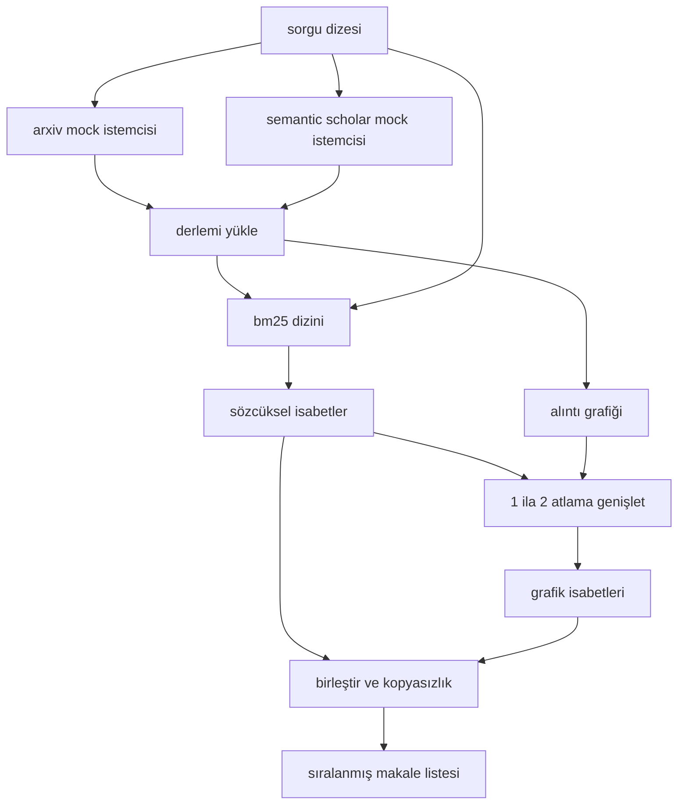

> **Orijinal İçerik:** [docs/en.md](https://github.com/rohitg00/ai-engineering-from-scratch/blob/main/phases/19-capstone-projects/51-literature-retrieval/docs/en.md)

# Literatür Erişimi

> Bir hipotez ucuzdur. Birinin onu zaten kanıtlayıp kanıtlamadığını bilmek pahalı kısımdır. Koşucu bir sandbox çalıştırmadan önce o soruyu yanıtlayan erişim katmanını kurun.

**Tür:** Uygulama
**Diller:** Python
**Ön Koşullar:** Faz 19 Track A dersleri 20-29
**Süre:** ~90 dakika

## Öğrenme Hedefleri

- Döngünün downstream okuyacağı alanlarla küçük bir makale kaydını modelleyin.
- Yalnızca stdlib veri yapılarıyla özetler üzerinde bir BM25 dizini kurun.
- Sözcüksel aramanın kaçırdığı makaleleri yüzeye çıkarmak için bir alıntı grafiğinde yürüyün.
- Kararlı makale kimlikleriyle sözcüksel ve grafik geçişlerindeki isabetleri kopyasızlık yapın.
- Gerçek uç noktalar geldiğinde upstream çağrı sahası aynı kalacak şekilde iki mock dış API'yi tek bir istemcinin arkasına sarın.

## Neden iki erişim geçişi

Özetler üzerinde anahtar kelime araması, sorguyla kelime haznesi paylaşan makaleleri döndürür. Bu, yüzeyin çoğunu kapsar. İki durumu kaçırır. Birincisi, temel makale farklı kelime hazinesi kullandığında; örneğin "seyrek dikkat" sorgusu, "transformer yönlendirmesinde blok seçimi" başlıklı bir makaleyi kaçırır. İkincisi, ilgili makale bilinen bir çapayı alıntılayan bir takip olduğunda; çapayı bulup ileriye yürümek, özet havuzunu kaba kuvvetle taramaktan daha verimlidir.

Ders, her iki geçişi de kurar. Özetler üzerinden BM25 sözcüksel isabetleri yakalar. Bir alıntı grafiği geçişi, seed kümesini bir veya iki atlama ileri ve geri genişletir. Birlik, makale kimliğine göre kopyasızlık yapılır ve küçük bir birleşik skorla sıralanır.

## Makale şekli

```text
Paper
 id : str (kararlı tanımlayıcı, mock derlem için "p001")
 title : str
 abstract : str
 year : int
 authors : list[str]
 references : list[str] (bu makalenin alıntı yaptığı makale kimlikleri)
 citations : list[str] (bu makaleyi alıntı yapan makale kimlikleri)
 source : str (hangi mock api sağladı, "arxiv" veya "s2")
```

Referanslar ve alıntılar alanları, yönlendirilmiş alıntı grafiğini oluşturur. İki mock API örtüşen ama özdeş olmayan alanlar döndürür, dolayısıyla derlem yükleyici onları `id` üzerinden birleştirir.

## Mimari



Erişim istemcisi, her iki geçişi ve birleştirmeyi sahiplenir. Arayan ona bir sorgu verir ve her giriş makale başına puanlama alanlarını (`bm25_score`, `graph_distance`, `recency_score`, `final_score`) açıklayan sıralanmış bir liste geri alır.

## Sıfırdan BM25

Uygulama, `k1=1.5`, `b=0.75` varsayılan parametreleriyle standart Okapi BM25'tir. Dizin iki sözlüktür: `term -> doc_frequency` ve `term -> (doc_id, term_count) listesi`. Belge uzunluğu, özetin token sayısıdır. Ortalama belge uzunluğu, dizin kurma zamanında bir kez hesaplanır. Bir sorguyu puanlamak, sorgu terimleri üzerinden `idf * tf_norm` toplamıdır; burada `tf_norm`, standart BM25 uzunluk normalleştirilmiş terim sıklığıdır.

Tokenizer `lower` sonra alfasayısal olmayan üzerinden bölmedir. Kökten çıkarılmaz. Üretim bir sistemi küçük bir kök çıkarıcı takardı. Arayüz aynı kalır.

```text
idf(t) = log((N - df + 0.5) / (df + 0.5) + 1.0)
tf_norm(t) = (f * (k1 + 1)) / (f + k1 * (1 - b + b * dl / avgdl))
score(d, q) = q'daki t üzerinden idf(t) * tf_norm(t) toplamı
```

## Alıntı grafiği geçişi

Grafik, derlemden bir kez kurulur. İleri kenarlar bir makaleden referanslarına gider. Geri kenarlar bir makaleden alıntılarına gider. Geçiş, en iyi BM25 isabetleriyle seedlenen, iki atlama ile sınırlanan bir BFS'tir.

İki atlama kasıtlı bir tavandır. Bir atlama çok sığdır; ajan genellikle acil atayı veya torunu ister. Üç atlama, bağlantılı bir grafikte sonuç boyutunu patlatır ve konudan sapma eğilimi gösterir. Ders, atlama sınırını bir config düğmesi olarak açar, böylece downstream bir döngü onu sıkılaştırabilir.

## Kopyasızlık ve sıralama

İki geçiş örtüşen kümeler döndürür. Birleştirme, makale kimliğine göre anahtarlanır. Her makale için son skor, ağırlıklı bir karışımdır.

```text
final_score = w_bm25 * bm25_score_norm
 + w_graph * graph_score
 + w_recency * recency_score
```

`bm25_score_norm`, BM25 skorunun birleştirilmiş kümedeki maksimum BM25 skoruna bölünmesidir (böylece alan sıfır-bir aralığında yaşar). `graph_score`, doğrudan sözcüksel isabetler için birdir, sonra bir atlama için `0.6`, iki atlama için `0.3`, aksi takdirde sıfırdır. `recency_score`, derlemin minimum yılında sıfırdan maksimum yılında bire doğrusal bir rampadır.

Varsayılan ağırlıklar `0.5`, `0.3`, `0.2`'dir. Ağırlıklar config'tir; bayat bir konu yenilik (recency) aşağı çekerken, hızlı hareket eden bir konu onu yükseltir.

## Mock derlem

Derlem, `build_corpus()` tarafından üretilen yüz makaledir. Her makale, beş konudan birinde elle yazılmış bir başlığa ve özete sahiptir: dikkat seyrekliği, erişim artırma (retrieval augmentation), düşük rank adaptörler, veri kümesi damıtma ve değerlendirme demetleri. Referanslar ve alıntılar, her konunun birkaç konu arası kenarı olan bağlantılı bir alt grafik oluşturması için kablolanmıştır.

İki mock API istemcisi (`ArxivMockClient`, `SemanticScholarMockClient`) aynı derlemden okur ancak farklı alanları açar. Arxiv, başlık, özet, yıl, yazarlar döndürür. Semantic Scholar, referanslar ve alıntılar ekler. Erişim istemcisi `id` üzerinde birleştirir; istemciler arası alan anlaşmazlığı işleme, bir takip derse ertelenir.

## Elli iki ve elli üç numaralı dersler ne okur

Elli iki numaralı dersteki koşucu, deney için bağlam olarak `paper.id`, `paper.title` ve özetin ilk üç cümlesini okur. Elli üç numaralı dersteki değerlendirici, bir taban çizgisini belirli bir makaleye atfetmek için `paper.year` ve `paper.references`'ı okur.

Erişim istemcisi, hem sıralanmış listeyi hem de sorgu başına metrikleri içeren bir `RetrievalResult` döndürür: isabet sayısı, ortalama skor, en yüksek skor, toplam duvar zamanı. Koşucu bunları loglar, böylece downstream bir gözlemlenebilirlik geçişi zaman içinde kaliteyi çizebilir.

## Kodu nasıl okunur

`code/main.py`, `Paper`, `ArxivMockClient`, `SemanticScholarMockClient`, `BM25Index`, `CitationGraph`, `RetrievalClient` ve deterministik bir demo tanımlar. Mock istemciler ve derlem aynı dosyada, böylece ders taşınabilir kalır. BM25 uygulaması tek bir sınıf, altmış satır. Grafik geçişi tek bir yöntemdir.

`code/tests/test_retrieval.py`, sözcüksel yolu, grafik yolunu, birleştirmeyi, kopyasızlığı ve boş sorguyu kapsar.

## Bu, nereye oturur

Elli numaralı ders bir hipotez üretir. Elli bir numaralı ders o hipotezin literatür tarafından zaten kararlaştırılıp kararlaştırılmadığını arar. Elli iki numaralı ders, kararlaştırılmamışsa deneyi çalıştırır. Elli üç numaralı ders, hem erişim sonucunu hem de deney metriklerini okur ve hükmü yazar. Erişim istemcisi, dört aşamanın en ucuzu ve orkestratörde ilk çalışanıdır.
