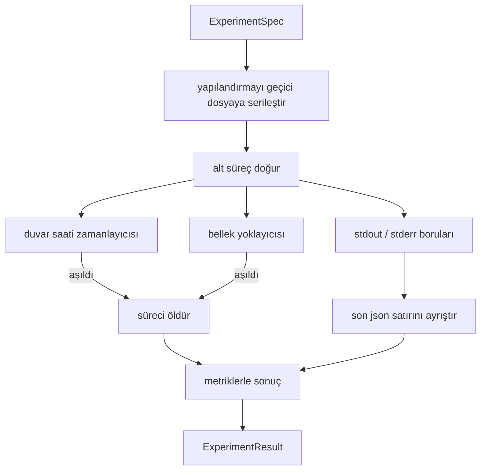

> **Orijinal İçerik:** [docs/en.md](https://github.com/rohitg00/ai-engineering-from-scratch/blob/main/phases/19-capstone-projects/52-experiment-runner/docs/en.md)

# Deney Koşucusu

> Döngü, yalnızca ölçümleri kadar dürüsttür. Bir belirtimi alan, onu sandbox'lanmış bir alt süreçte yürüten ve değerlendiricinin güvenebileceği bir json metrik blobu yayan koşucuyu kurun.

**Tür:** Uygulama
**Diller:** Python
**Ön Koşullar:** Faz 19 Track A dersleri 20-29
**Süre:** ~90 dakika

## Öğrenme Hedefleri

- Bir deneyi, koşucunun bir alt sürece serileştirebileceği tiplendirilmiş bir belirtim olarak kodlayın.
- Sert bir duvar saati zaman aşımı ve yumuşak bir bellek sınırı ile bir alt süreç başlatın ve her ikisini de terminal koşulları olarak yüzeye çıkarın.
- stdout, stderr ve yapılandırılmış metrik blobunu tek bir sonuç kaydına yakalayın.
- Sabit bir temel belirtim üzerinde bir yapılandırma düğmesini bir seferde tarayan bir ablasyon tablosu kurun.
- Bir seed verildiğinde her sonucu deterministik tutun, böylece değerlendirici çalıştırmalar arasında aynı sayıları görür.

## Neden bir alt süreç

Bir araştırma döngüsü güvenilmeyen kod çalıştırır. Hipotez bir örnekleyiciden geldi, deney betiği aynı yoldan geldi; birini süreç içinde güvenli olarak ele almak, orkestratörü çöken bir kilitlenmenin indirmesini istemektir. Alt süreçler, dilin gönderdiği en basit yalıtımdır: ayrı bir süreç, bağımsız bir adres alanı, ebeveyn tarafında bir sinyal kolu.

Buradaki koşucu tam yalıtım uygulamaz. cgroup, seccomp filtresi, ad alanı yeniden eşlemesi yoktur. Sahip olduğu şey bir duvar saati zaman aşımı, bellek büyümesi için yoklama döngüsü ve her iki sınırda süreci sonlandıran bir öldürme yoludur. Bu, daha ayrıntılı her sandbox'ın genişlettiği çalışma zamanı sözleşmesidir. Ders, sözleşmeyi bir oturuşta okunacak kadar küçük tutar.

## ExperimentSpec şekli

```text
ExperimentSpec
 spec_id : str (kararlı kimlik, "exp_001")
 hypothesis_id : int (elli numaralı dersteki kuyruğa geri bağlantı)
 script_path : str (çalıştırılacak python betiğinin yolu)
 config : dict (tek bir json argümanı olarak betiğe geçirilir)
 seed : int (deney için deterministik seed)
 wall_timeout_s : float (sert zaman aşımı, aşıldığında öldürülür)
 memory_cap_mb : int (yumuşak sınır, yoklanır; aşıldığında öldürülür)
 metric_keys : list[str] (değerlendiricinin okuyacağı alanlar)
```

Betiği diskte yaşar; koşucu, yapılandırmayı betiğin okuduğu geçici bir dosya yoluna yazar. Betiğin, anahtarları `metric_keys`'in bir üst kümesi olan tek bir json satırını stdout'a yazdırması beklenir. stdout'taki başka her şey yakalanır ancak metrik ayrıştırıcısı tarafından yok sayılır.

## Mimari



Koşucu, tek bir ana yöntemi olan tek bir sınıftır. Yoklayıcı, periyodik olarak uyanan ve kullanılabilir olduğunda alt süreç `psutil` eşdeğerini proc dosya sisteminden okuyan, platform açığa çıkarmadığında no-op'a geri dönen küçük bir iş parçacığıdır.

## Neden yumuşak bir bellek sınırı

Sert bellek sınırları `resource.setrlimit` gerektirir ve yalnızca POSIX'te çalışır. Ders taşınabilir bir yaklaşım gönderir: platformdan yerleşik küme boyutunu (RSS) yoklar ve sınırı aşarsa alt süreci öldürür. Sınır yumuşaktır çünkü yoklayıcının sıfır olmayan bir aralığı vardır; bir süreç yoklama arasında sınırın üzerine sıçrayıp sonra geri düşebilir. Koşucu, gözlemlenen maksimum RSS'yi kaydeder, böylece değerlendirici çalıştırmanın sınıra ne kadar yaklaştığını görebilir.

Süreç inceleme desteği olmayan sistemlerde yoklayıcı, bir kerelik bir uyarı loglar ve kendini devre dışı bırakır. Duvar saati zaman aşımı hâlâ geçerlidir. Ders testleri her iki yolu da kapsar.

## stdout ve stderr yakalama

Koşucu, tamamlanma üzerine boşaltılan her iki boruyu okur. Stdout, satır satır taranır; tüm gerekli `metric_keys`'i içeren json olarak ayrıştırılan son satır, metrik blobu olarak alınır. Önceki json satırları, sonuçta `intermediate_metrics` olarak tutulur; değerlendirici bunları öğrenme eğrileri için kullanabilir.

Stderr, sonuca olduğu gibi yakalanır. Koşucu, sıfır olmayan bir çıkış kodunda asla hata vermez; bunun yerine kodu sonuca kaydeder. Sıfır olmayan herhangi bir çıkış, betik metrikleri yazdırmış olsa bile `"crash"` olarak etiketlenir, böylece değerlendirici kısmi çalıştırmaları varsayılan olarak başarısızlık olarak ele alır.

## Ablasyon tablosu

```python
def ablate(base: ExperimentSpec, knob: str, values: list[Any]) -> list[ExperimentSpec]:
 ...
```

Bir temel belirtim ve bir düğme adı verildiğinde, yardımcı, `config[knob]` geçersiz kılınmış olarak değer başına bir belirtim döndürür. Her belirtim türetilmiş bir `spec_id` alır (`f"{base.spec_id}_{knob}_{value}"`). Koşucu, bunları sırayla çalıştıran ve düğme değerine göre anahtarlanmış bir `AblationTable` döndüren bir `AblationRunner` gönderir.

Neden bir seferde bir düğme. Tam faktöriyel taramalar üssel olarak patlar ve değerlendiricinin yorumlayamayacağı sonuçlar üretir. Bir seferde bir düğme, değerlendiricinin çizebileceği temiz bir eksen üretir. Ders, çok düğmeli taramaları yalnızca tekrarlanan tek düğmeli ablasyonlar olarak destekler, arayan tarafından oluşturulur.

## Determinizm

Her belirtim bir seed taşır. Koşucu, seed'i betiğe config dict aracılığıyla iletir (`config["__seed"] = spec.seed`). `code/experiments/` içindeki mock deney betikleri, seed'i onurlandırır ve çalıştırmalar arasında özdeş metrikler üretir. Elli üç numaralı dersteki değerlendirici buna bağlıdır; determinizm olmadan, bir "gerileme" farklı bir rastgele başlatma olabilir.

## Mock deney betiği

Ders bir deney betiği gönderir: `code/experiments/sparsity_experiment.py`. Yapılandırma dosyasını okuyan, bir numpy rastgele geçişiyle küçük bir eğitim çalıştırmasını simüle eden ve bir json metrik blobu yazdıran gerçek bir betiktir. Betik, zaman aşımlarını test etmek için bir `sleep_s` düğmesini ve bellek yoklayıcısını test etmek için bir `allocate_mb` düğmesini onurlandırır.

Simülasyon gerçek bir şey eğitmez. Bir eğitim döngüsünün şeklini taklit eden sayısal bir hesaplamadır: bir kayıp eğrisi, son bir perplexity, bir duvar zamanı. Dersin amacı koşucudur, simülasyon değil. Gerçek bir deney betiği bir model içe aktarırdı.

## Sonuç şekli

```text
ExperimentResult
 spec_id : str
 hypothesis_id : int
 exit_code : int
 terminal : "ok" | "timeout" | "oom" | "crash"
 wall_time_s : float
 peak_rss_mb : float | None
 metrics : dict
 intermediate_metrics : list[dict]
 stdout_tail : str
 stderr_tail : str
```

Değerlendirici önce `metrics` ve `terminal`'i okur. Terminal `"ok"` dışında bir şeyse deney, başarısız bir çalıştırma olarak sayılır ve değerlendiricinin hükmü otomatiktir. Aksi takdirde metrikler, anlamlılık testinden geçirilir.

## Kodu nasıl okunur

`code/main.py`, `ExperimentSpec`, `ExperimentResult`, `ExperimentRunner`, `AblationRunner` ve deterministik bir demo tanımlar. Alt süreç yönetimi tek bir sınıftır. Bellek yoklayıcısı küçük bir iş parçacığıdır. Ablasyon yardımcısı tek bir fonksiyondur.

`code/experiments/sparsity_experiment.py`, testlerde kullanılan mock deneydir. argv'den yapılandırma dosyası yolunu okur ve tamamlanma üzerine tek bir json metrik satırı yazar.

`code/tests/test_runner.py`, başarı yolunu, zaman aşımı yolunu, çökme yolunu, ablasyon tablosunu ve iki çalıştırma arasındaki determinizm kontrolünü kapsar.

## Bu, nereye oturur

Elli numaralı ders hipotezi üretir. Elli bir numaralı ders, literatürün kararlaştırdığı her şeyi filtreler. Elli iki numaralı ders, geriye kalanlar için deneyi çalıştırır. Elli üç numaralı ders, sonucu okur, anlamlılık testini çalıştırır ve orkestratörün hipotez kimliğine karşı sakladığı hükmü yazar.
