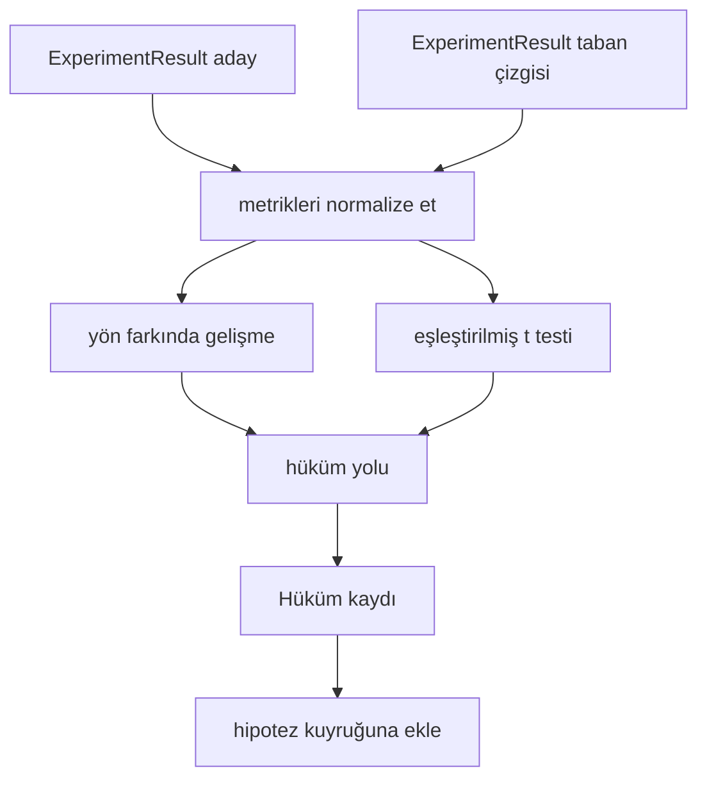

> **Orijinal İçerik:** [docs/en.md](https://github.com/rohitg00/ai-engineering-from-scratch/blob/main/phases/19-capstone-projects/53-result-evaluator/docs/en.md)

# Sonuç Değerlendiricisi

> Koşucu sayılar üretti. Değerlendirici, bu sayıların bir gelişme, gerileme veya gürültü olup olmadığına karar verir. Metrikleri tek satırlık bir sonuca dönüştüren hüküm yolunu kurun.

**Tür:** Uygulama
**Diller:** Python
**Ön Koşullar:** Faz 19 Track A dersleri 20-29
**Süre:** ~90 dakika

## Öğrenme Hedefleri

- Bir aday çalıştırmayı, yön farkında bir gelişme ve sabit bir eşik kullanarak bir taban çizgisine karşı karşılaştırın.
- Seed başına metrikler üzerinden sıfırdan eşleştirilmiş bir t testi çalıştırın ve sonuç p değerini okuyun.
- Downstream bir raporun onları doğrusal metriklerle harmanlayabilmesi için logaritmik ölçekli metrikleri normalize edin.
- Orkestratörün elli numaralı dersteki kuyruğa iliştirebileceği hipotez başına bir hüküm yayınlayın.
- Her adımı saf tutun, böylece aynı girdiler her zaman aynı hükmü üretir.

## Neden eşleştirilmiş bir test

Koşucudan gelen tek bir sayı, değişikliğin gerçek olup olmadığını söylemez. Aynı yapılandırma farklı bir seed ile farklı bir perplexity verir. Değişiklik gürültü olabilir. Doğru karşılaştırma eşleştirilmiş: aynı verilerle aynı seed'ler, bir kez adayla ve bir kez taban çizgisiyle çalıştırıldı. Her seed bir fark katkıda bulunur. Bu farkların ortalaması etkidir. Bu farkların standart hatası gürültü tabanıdır.

Ders, testi sıfırdan uygular. `scipy.stats` yoktur. Matematik tek bir ekranda okunacak kadar küçüktür.

```text
diffs = [a_i - b_i for i in seeds]
mean = sum(diffs) / n
variance = sum((d - mean) ** 2 for d in diffs) / (n - 1)
t_stat = mean / sqrt(variance / n)
df = n - 1
p_value = two_sided_p(t_stat, df)
```

İki taraflı p değeri, düzenli hale getirilmiş eksik beta fonksiyonunu kullanır. Ders, Lentz sürekli kesrini kullanan küçük bir uygulama gönderir. Her şey stdlib matematiğinin altmış satırıdır.

## Yön farkında gelişme

Bazı metrikler yükseldiğinde gelişir (doğruluk, çıktı). Diğerleri düştüğünde gelişir (kayıp, perplexity, duvar zamanı). Değerlendirici, her metrik üzerinde bir `direction` alanı taşır.

```text
if direction == "higher_is_better":
 improvement = (candidate - baseline) / abs(baseline)
elif direction == "lower_is_better":
 improvement = (baseline - candidate) / abs(baseline)
```

Gelişme işaretlidir. Daha yüksek-daha iyi bir metrik üzerindeki negatif bir gelişme, adayın daha kötü olduğu anlamına gelir. Hüküm yolu, işareti ve büyüklüğü birlikte okur.

Düz bir eşik (`improvement_threshold=0.02`, yüzde iki), değişikliğin aramaya yetecek kadar büyük olup olmadığına karar verir. Altındaysa, p değerinden bağımsız olarak hüküm "gürültü"dür; döngü, kullanıcının ölçemeyeceği değişikliklerle ilgilenmez.

## Mimari



Değerlendirici, üç bağımsız hesaplama çalıştırır ve onları hüküm yolunda birleştirir. Her hesaplama, paylaşılan durumu olmayan saf bir fonksiyondur.

## Log normalizasyonu

Perplexity, kayıpta üsteldir. Kayıpta 0.1'lik bir düşüş, perplexity'de çok daha büyük bir düşüştür. İki yapılandırma boyunca perplexity'yi doğrudan karşılaştırmak iyidir, ancak tek bir raporda onu doğrusal metriklerle harmanlamak normalleştirme gerektirir.

Ders, `scale` alanı `"log"` olan herhangi bir metriği, gelişmeyi hesaplamadan önce doğal logaritmasını alarak normalleştirir. Eşik, daha sonra log uzayında uygulanır. 32'den 28'e bir perplexity düşüşü, `log(28) - log(32) = -0.133` değeridir, daha düşük-daha iyi bir metrik üzerinde, yüzde iki eşiğinin oldukça üzerindedir.

```text
if scale == "log":
 a = log(candidate)
 b = log(baseline)
else:
 a = candidate
 b = baseline
```

`scale="linear"` (varsayılan) olan metrikler dönüşümü atlar. Aynı kod yolu her ikisini de ele alır.

## Seed başına eşleştirilmiş test

Elli iki numaralı dersteki koşucu, çalıştırma başına bir son metrik blobu yayar. Eşleştirilmiş test için değerlendirici, aday için seed başına bir blob ve taban çizgisi için seed başına bir blob gerektirir. Orkestratör, aynı deneyi her iki yapılandırma altında bir seed listesi boyunca çalıştırır ve değerlendiriciye iki `ExperimentResult` kayıt listesi verir.

Değerlendirici, onları seed'e göre eşleştirir (seed `result.metrics["seed"]` içinde yaşar) ve istenen metrik boyunca yürür. İki listedeki seed'ler eşleşmezse, değerlendirici bir `PairingError` fırlatır. Orkestratör yeniden çalıştırmalıdır.

## Hüküm şekli

```text
Verdict
 hypothesis_id : int
 metric : str
 direction : "higher_is_better" | "lower_is_better"
 scale : "linear" | "log"
 candidate_mean : float
 baseline_mean : float
 improvement : float (işaretli, kesir; yön kurallarına bakın)
 p_value : float | None (n < 2 ise Yok)
 significance_threshold : float
 improvement_threshold : float
 verdict : "improved" | "regressed" | "noise" | "failed"
 rationale : str
```

Hüküm yolu küçük bir karar tablosudur:

```text
1. Herhangi bir aday sonucunun terminal'ı != "ok" ise: hüküm = "failed"
2. yoksa |gelişme| < gelişme_eşiği ise: hüküm = "noise"
3. yoksa p_value Yok veya p_value > anlamlılık ise: hüküm = "noise"
4. yoksa gelişme > 0 ise: hüküm = "improved"
5. yoksa: hüküm = "regressed"
```

Gerekçe, orkestratörün hipotez kimliğine karşı loglayabileceği tek satırlık insan-okunabilir bir cümledir.

## Kodu nasıl okunur

`code/main.py`, `MetricSpec`, `Verdict`, `Evaluator`, t istatistiği ve eksik beta yardımcılarını ve deterministik bir demo tanımlar. t testi, saf stdlib matematiğinde uygulanır; numpy yalnızca metrik listesini okumak ve ortalamaları ve varyansları hesaplamak için kullanılır.

`code/tests/test_evaluator.py`, gelişmiş yolu, gerilemiş yolu, gürültü yolunu (küçük gelişme), gürültü yolunu (düşük n), başarısız terminal yolunu, log normalleştirilmiş yolu, bilinen bir referans değerine karşı t testini ve eşleştirme hatasını kapsar.

## Bu, nereye oturur

Elli numaralı ders hipotez kuyruğunu üretti. Elli bir numaralı ders, literatürün kararlaştırdığı her şeyi filtreledi. Elli iki numaralı ders, deneyi aday ve taban çizgisi yapılandırmaları altında seed'ler boyunca çalıştırdı. Elli üç numaralı ders, bu çalıştırmaları okur ve hükmü yazar. Orkestratör, dördünü birbirine diker:

```text
for hypothesis in queue:
 literature = retrieval.search(hypothesis.text)
 if literature_settles(hypothesis, literature):
 attach(hypothesis, verdict="settled")
 continue
 candidates = runner.run_all(specs_for(hypothesis))
 baselines = runner.run_all(baseline_specs_for(hypothesis))
 metric_spec = MetricSpec("perplexity", direction=LOWER, scale=LOG)
 verdict = evaluator.evaluate(hypothesis.id, metric_spec, candidates, baselines)
 attach(hypothesis, verdict)
```

O orkestratör bu derste değildir; dört ders, her birinin tanımladığı veri sınıflarının ötesinde herhangi bir yapıştırıcı olmadan onu oluşturur.
