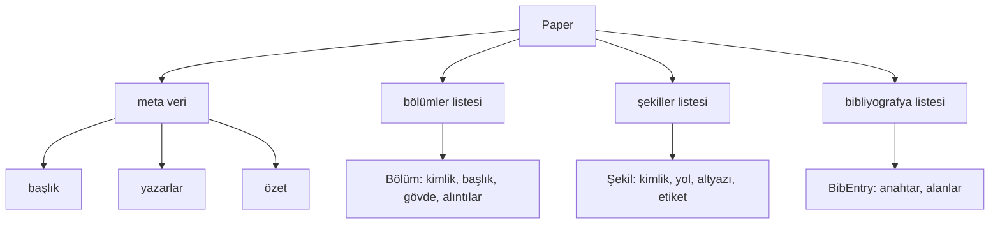
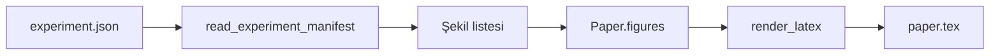
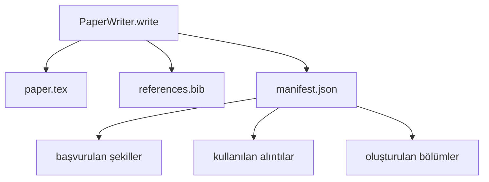

> **Orijinal İçerik:** [docs/en.md](https://github.com/rohitg00/ai-engineering-from-scratch/blob/main/phases/19-capstone-projects/54-paper-writer/docs/en.md)

# Makale Yazarı

> Bir LaTeX iskeleti, araştırmacı ve dizgici arasındaki bir sözleşmedir. Sözleşme bozulursa belge derlenmez ve başarısızlık yüksek seslidir. Önce iskeleti kurun, sonra doldurun.

**Tür:** Uygulama
**Diller:** Python
**Ön Koşullar:** Faz 19 dersleri 50-53
**Süre:** ~90 dakika

## Öğrenme Hedefleri

- Bir araştırma makalesini, serbest biçimli bir belge değil, bilinen bir bölüm grafiğine sahip yapılandırılmış bir yapıt olarak ele alın.
- Herhangi bir düz yazı yazılmadan önce, özetini, bölümlerini, şekil yuvalarını ve bibliyografya anahtarlarını bildiren bir LaTeX iskeleti üretin.
- Deney çıktılarından (yollar ve altyazılar) şekilleri, deterministik bir yuva mekanizması aracılığıyla iskelete enjekte edin.
- Hat, bir model olmadan test edilebilir olması için, yapılandırılmış bir anahat'tan her bölümü dolduran sahte bir düz yazı üreticisini bağlayın.
- Başvurulan her şekli ve kullanılan her alıntıyı listeleyen tek bir `paper.tex` artı bir `references.bib` artı bir manifesto yayınlayın.

## Neden önce iskelet

Düz yazı olarak başlayan bir taslak, yapısal borç biriktirir. Giriş, ilgili çalışmada olması gereken üç paragraf büyütür. Bir şekil, tanımlanmadan önce başvurulur. Bibliyografya, aynı makale için üç anahtarla biter. Yazar fark ettiğinde, yeniden yazma maliyeti yazma maliyetinden yüksektir.

İskelet bunu tersine çevirir. Yapı, baştan veri olarak bildirilir. Bölümler, adları ve sıraları olan yuvalardır. Şekiller, kimlikleri ve altyazıları olan yuvalardır. Bibliyografya anahtarları, üstte, işaret ettikleri girişlerle bildirilir. Düz yazı, bu yuvalara birer birer üretilir. Hat, herhangi bir düz yazı yazılmadan önce, her şeklin bir yuvası olduğunu, her alıntının bir girişi olduğunu ve her bölümün içindekiler tablosunda göründüğünü doğrulayabilir.

Bu, erken derslerin planlara, araç çağrılarına ve iz'lere uyguladığı aynı disiplindir. Yapı sözleşmedir.

## Kağıt şekli

Her alan, sade Python verisidir. Oluşturucu, `Paper`'dan bir LaTeX dizesine saf bir fonksiyondur. Hat, oluşturmadan önce makaleyi içe bakabilir: bölümleri saymak, eksik şekil dosyalarını listelemek, her `\cite{key}`'in eşleşen bir `BibEntry`'si olduğunu kontrol etmek.

## Oluşturma sözleşmesi

Oluşturucu üç özelliği garanti eder. Birincisi, iskeletteki her şekil yuvası, `fig:<id>` formunda kararlı bir etiketle bir `\begin{figure}` bloğu yayar. İkincisi, her bölüm, çapraz başvuruların çalışması için `sec:<id>` formunda kararlı bir etiketle bir `\section{}` yayar. Üçüncüsü, bibliyografya, `references.bib`'inde tam olarak bildirilen girişleri içeren bir `\bibliography` bloğu yayar, ne fazla ne eksik.

Bunlardan herhangi birini ihlal etmek, bir uyarı değil, bir oluşturma hatasıdır. İskelet sözleşmedir; bir şekli sessizce düşüren bir oluşturucu, bir sözleşme ihlalidir.

## Deneylerden şekil enjeksiyonu

Bu parçadaki erken dersler, deney çıktılarını JSON manifestoları olarak üretti. Her manifesto, yolları ve kısa altyazıları olan bir yapıt listesi taşır. Makale yazarı, bu manifestoyu okur ve `Figure` kayıtları üretir.

Enjeksiyon deterministiktir. Şekil kimlikleri, deney adı artı tekdüze bir sayacdan türetilir. Altyazılar manifestodan gelir. Yollar, makalenin çıktı dizinine göre normalleştirilir, böylece deney çıktıları disk üzerinde başka yerde oturuyor olsa bile LaTeX derlenir.

## Sahte düz yazı üreticisi

Ders bir model çağırmaz. `MockProseGenerator` bir anahat şekli okur ve deterministik olarak düz yazı yayar. Anahat şekli, bölüm başına bir kısa dizedir. Üretici, bölüm başlığını içine dokuyarak bu dizeyi iki kısa paragrafa genişletir. Üretilen düz yazı, anahatın bildirdiği zaman tam olarak şekilleri ve alıntıları isimlendirir.

Bu, yazarın her davranışını test etmek için yeterlidir. Gerçek bir uygulama, üreticiyi bir model çağrısıyla değiştirir. Etrafındaki hat değişmez. Düz yazı üreticisini çağrılabilir (callable) olarak bildirmenin değeri budur: test deterministik bir tane yerleştirir, üretim model bir tane yerleştirir, hattın geri kalanı özdeştir.

## Manifesto çıktısı

Yazar, çıktı dizinine üç dosya yayar.

Manifestoyu, downstream bir değerlendirici veya eleştirmen döngüsü okur. LaTeX'i ayrıştırmaz; manifestoyu okur. Sonraki ders, eleştirmen döngüsü, bu manifestoyu girdi olarak alır ve bir geri bildirim listesi üretir. Bu, manifestonun sözleşmenin bir parçası olmasının ve LaTeX'in olmamasının nedenidir.

## Doğrulama geçitleri

Yazar, herhangi bir dosya yazmadan önce dört geçit çalıştırır.

1. Her şekil kimliği makale içinde benzersizdir.
2. Her bölümün `cites` alanı, makale üzerinde bildirilen bir bibliyografya anahtarına başvurur.
3. Özet boş değildir.
4. Başlık boş değildir.

Başarısız bir geçit, kesin bir nedenle `PaperValidationError` fırlatır. Hat, nedeni başarısızlık modu olarak yüzeye çıkarır. Kısmi yazma yoktur: ya üç dosya da yayınlanır ya da hiçbiri.

## Kodu nasıl okunur

`code/main.py`, `Paper`, `Section`, `Figure`, `BibEntry`, `PaperValidationError`, `MockProseGenerator`, `PaperWriter` ve bir `render_latex` fonksiyonu tanımlar. `write` yöntemi, bir çıktı dizini alır ve `paper.tex`, `references.bib` ve `manifest.json` yayar. `read_experiment_manifest` yardımcısı, bir deney manifestoları listesini `Figure` kayıtlarına dönüştürür.

`code/tests/test_paper_writer.py` şunları kapsar: bölüm olmadan iskelet oluşturma, iki bölüm ve iki şekille tam oluşturma, eksik-alıntı geçidi, kopya-şekil-kimliği geçidi, manifesto içeriği ve LaTeX-dize sözleşmesi (her bölüm bir `\section{}` yayar, her şekil bir `\begin{figure}` yayar).

## Daha ileri

Gerçek bir uygulamanın isteyeceği iki uzantı. Birincisi, çoklu format oluşturma: aynı `Paper` şekli, blog yazıları için Markdown ve önizlemeler için HTML derler. Oluşturucu, `Paper` üzerinde bir strateji olur. İkincisi, alıntı zenginleştirme: yazar, DOI'ların yerel önbelleği verildiğinde, bir alıntı anahtarından BibTeX girişleri alır. Her ikisi de değer katar, her ikisi de iskelet sözleşmesine dokunmadan eklenebilir.

İskelet bahistir. Bölümler, şekiller ve alıntılar veri olarak bildirilir, düz yazı yuvalara üretilir, manifesto LaTeX'in yanında yayınlanır. Diğer her geliştirme bunun üzerine oluşturulur.
