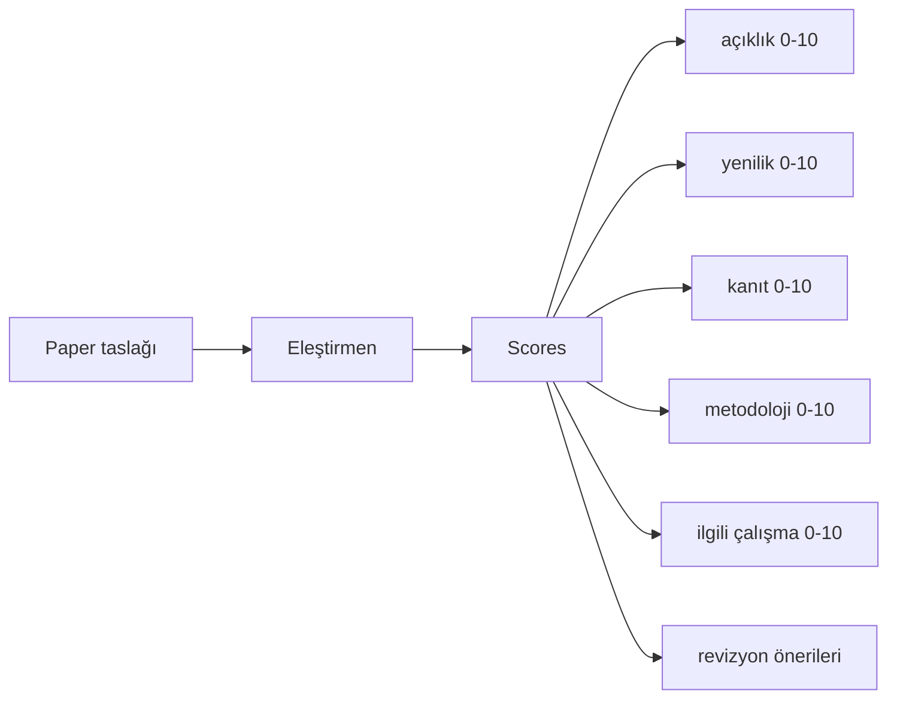
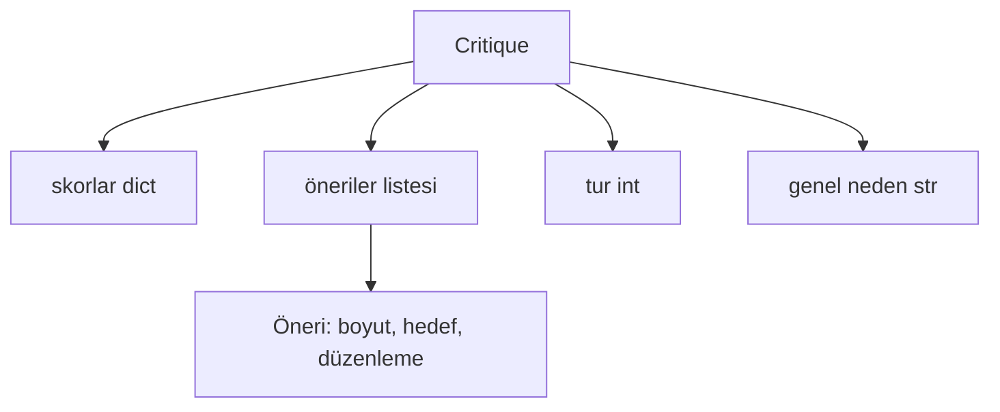
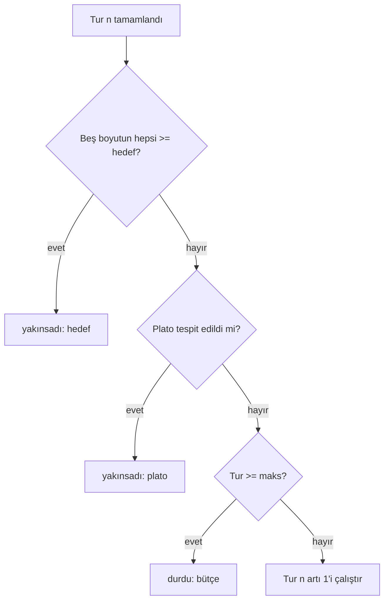
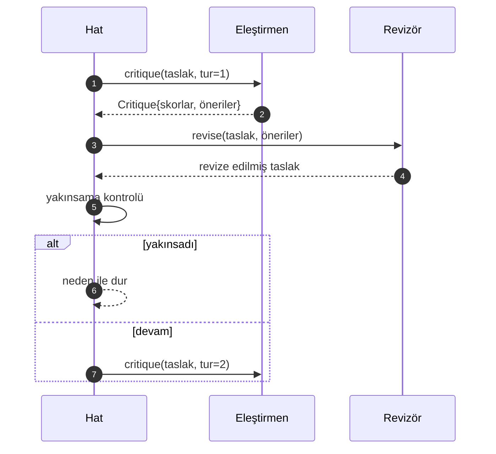

> **Orijinal İçerik:** [docs/en.md](https://github.com/rohitg00/ai-engineering-from-scratch/blob/main/phases/19-capstone-projects/55-critic-loop/docs/en.md)

# Eleştirmen Döngüsü

> İlk seferde "iyi görünüyor" diyen bir eleştirmen bozuktur. Her zaman "çalışma gerekli" diyen bir eleştirmen bozuktur. İlginç eleştirmen, yakınsayanıdır ve yakınsamayı mühendisliğe dökmeniz gerekir.

**Tür:** Uygulama
**Diller:** Python
**Ön Koşullar:** Faz 19 dersleri 50-53
**Süre:** ~90 dakika

## Öğrenme Hedefleri

- Bir makale taslağını beş sabit boyut üzerinden puanlayın: açıklık (clarity), yenilik (novelty), kanıt (evidence), metodoloji (methodology), ilgili çalışma (related-work).
- Her turun eleştirisini serbest biçimli bir yeniden yazma yerine yapılandırılmış bir revizyon farkı (diff) olarak uygulayın.
- Turlar arasında skorları karşılaştırarak yakınsamayı tespit edin; plato, hedef karşılandı veya bütçe tükendi durumlarında durun.
- Yakınsamayan bir eleştirmenin sonsuza kadar çalışmaması için maksimum iterasyon bütçesi ile turları sınırlayın.
- Pano veya bir sonraki aşamanın skor yörüngesini oluşturabilmesi için tur başına bir iz yayınlayın.

## Neden beş sabit boyut

Serbest biçimli bir eleştirmen, önerilerin paragrafını döndüren bir modeldir. Sonraki turun revizyonu, paragrafı çevresel bağlam olarak ele alır. Yeniden yazmanın eleştiriyi ele alıp almadığı, eleştirinin hiç yapısı olmadığı için doğrulanamaz.

Beş boyut, hata bir sözleşme verir.



Skor bir vektördür. Hat, her boyutu turlar boyunca izler. Açıklığı yükselten ama kanıtı batıran bir revizyon, kanıt üzerinde bir gerilemedir ve yakınsama kontrolü onu görür. Yalnızca model tabanlı bir eleştirmen bu garantiyi sunamaz.

## Eleştiri şekli



Her öneri, iyileştirdiği boyutu, hedeflediği bölümü ve revizyonun uygulayabileceği bir `edit` talimatını taşır. Revizyon da çağrılabilirdir. Ders, `edit` talimatını bölüme-ekleme işlemi olarak yorumlayan deterministik bir revizör gönderir. Model tabanlı bir revizör, aynı alanı bir istem olarak yorumlardı. Sözleşme değişmez.

## Yakınsama kuralları, sırayla

Eleştirmen döngüsü, üç koşuldan biri tetiklendiğinde sona erer.



Hedef, en sert durumdur: beş boyutun (açıklık, yenilik, kanıt, metodoloji, ilgili çalışma) her biri, `>= target_score` (varsayılan `8.0`) değerine ulaşmadan önce döngü başarı dönmez. Yüksek bir ortalama, zayıf bir boyutla yeterli değildir. Plato tespiti, mevcut turun ortalamasını önceki turun ortalamasıyla karşılaştırır. İyileşme, iki ardışık tur boyunca `plateau_epsilon`'un (varsayılan `0.1`) altındaysa, döngü `plateau` ile çıkar. Bütçe, turlar üzerinde sert bir sınırdır (varsayılan `5`) ve `budget` ile çıkar.

Sıra önemlidir. Hedef, plâtonun üzerinde, bütçenin üzerinde kazanır. Üçüncü tur, aynı iterasyonda bir plato da tetikleyeceği bir hedefe ulaşırsa, sonuç `target`'tır, `plateau` değil.

## Neden plato tespiti iki tur boyunca çalışır

Tek turluk bir plato gürültüdür. Gerçek bir eleştirmen, sabit bir taslakta bile her iterasyonda biraz farklı bir skor döndürür, çünkü deterministik puanlama bile hangi önerilerin ve hangi sırayla uygulandığına bağlıdır. İki ardışık plato turu gerektirmek, bu gürültüyü filtreler. Hat bir plato rapor ederse, taslak gerçekten iyileşmeyi durdurmuştur.

## Bu dersteki deterministik eleştirmen

Ders bir model çağırmaz. Gönderilen eleştirmen, üç sinyale dayalı bir taslağı puanlayan çağrılabilir bir şeydir: ortalama bölüm gövde uzunluğu (açıklık), şekil sayısı ve alıntı sayısı (kanıt) ve makale meta verileri üzerinde bir `originality_tag` alanı (yenilik). Revizör, her skoru yukarı itmeyi bilir.

```text
clarity      ortalama bölüm gövde uzunluğu arttıkça büyür
novelty      originality_tag "high" olarak ayarlandığında büyür
evidence     bir bölümün figure_refs'i boş olmadığında büyür
methodology  "Method" başlıklı bir bölüm gövdeyle var olduğunda büyür
related-work "Related Work" başlıklı bir bölüm gövdeyle var olduğunda büyür
```

Revizör, her öneriyi hedefli bir ekleme olarak yorumlar. Birinci turdan sonra hat, skorun yukarı gittiğini gözlemleyebilir. Testler, döngünün boşluğu azalttığını iddia etmek için bu özelliği kullanır.

## Tam döngü sözleşmesi



Hat, tur sayacını, izi ve yakınsama kontrolünü sahiplenir. Eleştirmen skoru sahiplenir. Revizör farkı sahiplenir. Üçü de diğerlerinin durumuna dokunmaz.

## İz çıktısı

Her tur, tur numarası, skor vektörü, öneri sayısı ve yakınsama hükmü ile bir iz olayı yayar. Tam iz, son taslakla birlikte döndürülür. Downstream bir pano, tur başına skor çizelgesini oluşturabilir. Sonraki ders, iterasyon zamanlayıcısı, dalın tutulmaya değer olup olmadığına karar vermek için izi okur.

## Kötü eleştirmenlere karşı koruyan bütçeler

Hiçbirbir zaman skoru iyileştirmeyen öneriler üreten bir eleştirmen, döngüyü maksimum iterasyon tavanına kilitler. İz bunu görünür kılar: beş tur, skorlar düz, hüküm `budget`. Kullanıcı bunu taslak hatası değil, eleştirmen hatası olarak okur. Alternatif olan, yalnızca son taslağı yüzeye çıkarmak, teşhisi gizler. İz-önce tasarımı onu yüzeye çıkarır.

## Kodu nasıl okunur

`code/main.py`, `Critique`, `Suggestion`, `Critic` protokolü, `Reviser` protokolü, `CriticLoop` ve deterministik bir eleştirmen-revizör çifti döndüren bir `make_deterministic_critic_pair` fabrikası tanımlar. Dersin tek başına durabilmesi için minimal bir `Paper` şekli dahil edilmiştir.

`code/tests/test_critic_loop.py` şunları kapsar: birinci turdan sonra tekdüze iyileşme, ayarlanmış bir taslak üzerinde hedef yakınsaması, iki düz turdan sonra plato tespiti, hiçbir öneri iyileştirmediğinde bütçe tükenmesi, revizör tarafından öneri uygulaması ve iz şekli.

## Daha ileri

Gerçek bir uygulamanın isteyeceği iki uzantı. Birincisi, boyut ağırlıkları: bir atölye çalışması için bir makale, yeniliği metodolojiden daha yüksek ağırlıklandırır; bir dergi tersini ağırlıklandırır. Yakınsama kontrolü ağırlıklı bir ortalama olur. İkincisi, eşleştirilmiş eleştirmenler: bir eleştirmen puanlar, ikinci bir eleştirmen, revizör onları görmeden önce önerileri hakemlik eder. Her ikisi de değer katar, her ikisi de aynı `Critique` şekli üzerine oluşturulur.

Bahis, skor vektörüdür. Eleştiri yapılandırıldıktan sonra, diğer her geliştirme, yakınsama kuralı, panosu, eşleştirilmiş eleştirmeni, döngüyü değiştirmeden düşer.
