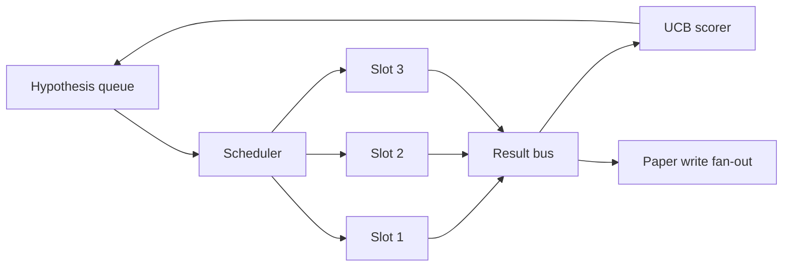
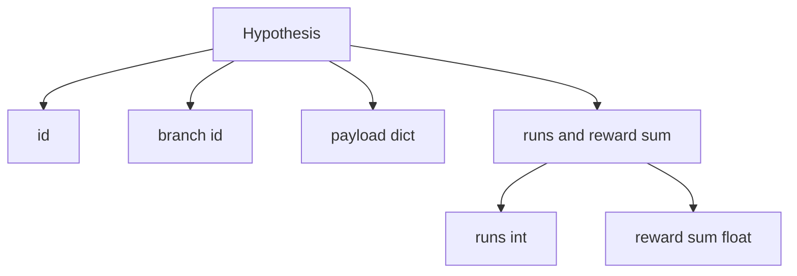
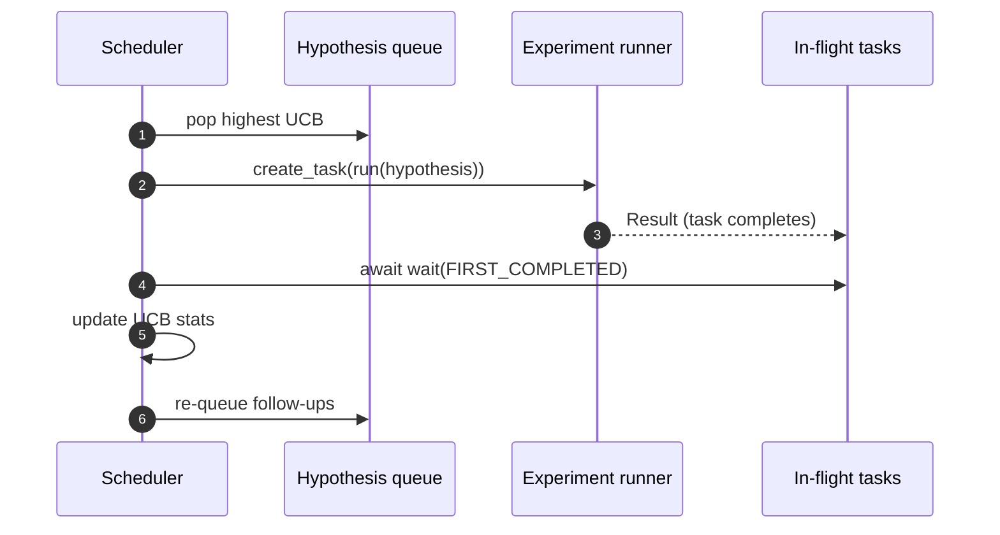

# Iterasyon Zamanlayıcı (Iteration Scheduler)

> Zamanlayıcısı olmayan bir araştırma döngüsü, sanrıları olan bir kuyruktur. Zamanlayıcı, döngünün neyi keşfetmeyi bırakacağına karar verdiği yerdir ve bu karar tüm oyunun kendisidir.

**Tür:** Build
**Diller:** Python
**Önkoşullar:** Phase 19 dersleri 50-53
**Süre:** ~90 dakika

## Öğrenme Hedefleri

- Bir araştırma iş akışını, sonuçların geri yelpazelenerek aktığı paralel deney yuvalarını besleyen bir hipotez kuyruğu (hypothesis queue) olarak modelleyin.
- Zamanlayıcının tüm yuvaları meşgul tutabilmesi için asyncio ile birden fazla deneyi eşzamanlı çalıştırın.
- Zamanlayıcının keşfi terk etmeden düşük verimli dalları budayabilmesi için her hipotez dalını UCB ile puanlayın.
- Yüksek verimli bir dalın takip hipotezleri üretmesi için tamamlanan sonuçları, paper-write (makale yazma) aşamasına ve yeniden kuyruğa alma aşamasına yelpazeleyin.
- Dal puanları, yuva doluluğu (slot occupancy) ve budama kararlarıyla iterasyon başına bir iz (trace) sunun.

## Neden bir iş listesi değil, bir zamanlayıcı

Düz bir iş listesi (worklist) işleri gönderim sırasıyla çalıştırır. Her iş bağımsız olduğunda bu uygundur. Araştırma bağımsız değildir: üç numaralı deneyden gelen bir bulgu, dört ve beş numaralı deneylerin önceliğini değiştirir. Sonuç fan-in'ini okuyan ve kuyruğu yeniden sıralayan bir zamanlayıcı, birim hesaplama başına daha faydalı iş çıkarır.

İlginç tasarım seçimi puanlama kuralıdır. Açgözlü bir puanlayıcı her zaman o anki lideri seçer ve asla keşfetmez. Tekdüze bir puanlayıcı asla sömürmez (exploit). UCB (upper confidence bound, üst güven sınırı) orta yoldur: lideri sömürürken daha az denenmiş dallar için kapasite ayırır.

## Sistemin şekli



#### Açıklama
Kuyruk hipotezleri tutar. Zamanlayıcı bir yuva boşaldığında en yüksek UCB değerine sahip hipotezi seçer. Her yuva bir deneyi asenkron olarak çalıştırır. Tamamlanan deneyler sonuçlarını bus'a yelpazeler. Bus, kök dalın UCB istatistiklerini günceller ve dalın verimi bir eşiği aştığında paper-write aşamasına yelpazeler.

## Hipotezin şekli



#### Açıklama
`branch` UCB istatistikleri için anahtardır. Birden fazla hipotez aynı dalı paylaşabilir (dal araştırma yönüdür; hipotez o yön içindeki tek bir denemedir). `runs` o dal için tamamlanan deney sayısıdır; `reward_sum` kümülatif ödüldür. UCB ikisini birden okur.

## UCB puanlama

Bu derste kullanılan UCB formülü klasik UCB1'dir.

```text
ucb(branch) = mean_reward(branch) + c * sqrt( ln(total_runs) / runs(branch) )
```

#### Açıklama
`total_runs` tüm dallar boyunca tamamlanan deneylerin toplam sayısıdır. `c` keşif ağırlığıdır; derste varsayılan değer `sqrt(2)`'dir. Sıfır çalıştırması olan bir dal `+inf` alır, böylece henüz denenmemiş dallar her zaman önce zamanlanır. Ortalama ödülü yüksek olan bir dal, diğer dallar yetişene kadar yüksek puanını korur; çok çalıştırılıp fazla ödül üretemeyen bir dal ise daha az çalıştırılan alternatifler tarafından gölgelenir.

Budama (pruning) kapısı seçiciden ayrıdır. Budama, bir dalın ortalama ödülü mutlak bir tabanın (varsayılan `0.2`) altına düştüğünde ve en az `prune_after_runs` (varsayılan `3`) denemeden sonra o dalı gelecekteki zamanlamadan çıkarır. Bu, kuyruğun sınırlı kalmasını sağlar.

## asyncio ile paralel yuvalar

Zamanlayıcı deneyleri `asyncio.create_task` ile sürer. Her görev, bir `Result` döndüren deney çalıştırıcısını (async def callable) çalıştırır. Ana döngü, uçuşan görevler kümesini `asyncio.wait(..., return_when=asyncio.FIRST_COMPLETED)` ile bekler ve her tamamlanmada puanlama güncellemesini tetikler.



#### Açıklama
Üç yuva eşzamanlı çalışır. Ana döngü tek bir deneyde asla bloke olmaz. Zamanlayıcı, hem kuyruk boşalana hem de uçuşan görev kalmayana kadar bir yuva boşaldıkça yeni görevler başlatır.

## Fan-out: makale tetikleyicileri

Bir dalın ortalama ödülü `paper_threshold`'ı (varsayılan `0.7`) aştığında ve o dal henüz bir paper (makale) üretmediyse, zamanlayıcı bir `paper.trigger` olayını bir çıktı listesine yelpazeler. Aşağı yönde, elli dördüncü dersteki makale yazarı bunu devralır. Bu derste tetikleyici, testlerin doğrulayabilmesi için bir liste olarak yakalanır.

## Fan-out: takip hipotezleri

Yüksek verimli bir sonuç geldiğinde, zamanlayıcı aynı dal için bir veya daha fazla takip hipotezi üretmek üzere kullanıcının sağladığı `expander`'ı çağırabilir. Expander, `Result`'tan `list[Hypothesis]`'e saf bir fonksiyondur. Ders, ödülü paper threshold'ı aşan her sonuç için iki takip hipotezi üreten deterministik bir expander sağlar.

## Bütçeler (Budgets)

İki bütçe zamanlayıcıyı kontrolden çıkan döngülerden korur.

```text
max_experiments    : total count of experiments run across all branches
max_seconds        : wall-clock cap (asyncio time)
```

#### Açıklama
Bunlardan biri tetiklendiğinde, zamanlayıcı yeni görev zamanlamayı durdurur, uçuşan görevleri bekler ve son izi (trace) döndürür. İz bir `stop_reason` içerir.

## İz (Trace) ve nihai rapor

Her zamanlama kararı (seçim, gönderim, sonuç, budama, fan-out) bir olay yayar. Nihai rapor, dal başına istatistikleri, toplam çalıştırma sayısını, toplam duvar saatini (wall clock) ve tetiklenen paper trigger'ları özetler. Bir sonraki ders olan uçtan uca demo, makale yazarını sürmek için bu raporu okur.

## Kodu nasıl okumalı

`code/main.py`; `Hypothesis`, `Result`, `BranchStats`, `IterationScheduler` ve öngörülebilir ödüllerle bir asyncio deney çalıştırıcısı döndüren `make_deterministic_runner` fabrikasını tanımlar. Çalıştırıcı, eşzamanlılığın gözlemlenebilmesi için sabit bir `delay_ms` (varsayılan `5ms`) boyunca uyur.

`code/tests/test_scheduler.py` şunları kapsar: UCB'nin önce denenmemiş dalları seçmesi, paralel yuva doluluğu, eşik aşıldığında paper trigger'ları, düşük verimli denemelerden sonra dal budama, fan-out takip hipotezleri ve bütçe çıkışı (hem deney sayısı hem duvar saati).

## Daha ileriye

Gerçek bir uygulamanın isteyeceği üç genişletme. Birincisi, oturumlar arası kalıcı UCB istatistikleri: mevcut istatistikler bellekte yaşıyor; gerçek bir zamanlayıcı, zaten harcanan keşif bütçesinin bir yeniden başlatmada korunması için bunları checkpoint'ler. İkincisi, çok amaçlı puanlama: skaler bir ödül yerine her sonuç bir vektör yayar ve UCB Pareto tarzı bir seçici haline gelir. Üçüncüsü, bağlamsal banditler (contextual bandits): seçici, hipotez özelliklerine (uzunluk, karmaşıklık) göre koşullandırılır, böylece benzer hipotezler keşfi paylaşır.

Zamanlayıcı, araştırmanın bir iş listesinden fazlası haline geldiği yerdir. UCB bağlandığında ve yuvalar paralel çalıştığında, diğer her iyileştirme bunun üzerine eklemlenir.
