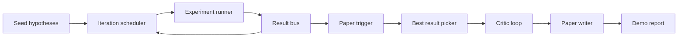
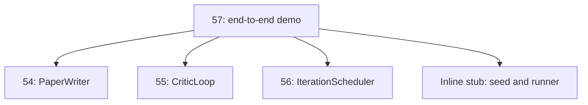
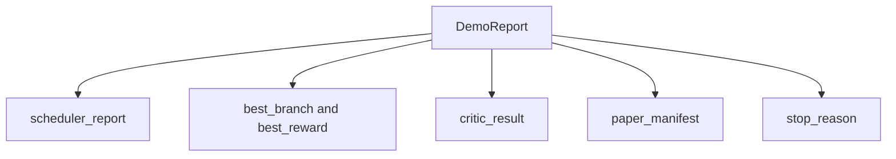

# Uçtan Uca Araştırma Demosu (End-to-End Research Demo)

> Demo, daha önce yazdığınız her sözleşmenin (contract) bir araya gelmek zorunda olduğu yerdir. Herhangi biri sızarsa, demo bunu yakalayan derstir.

**Tür:** Build
**Diller:** Python
**Önkoşullar:** Phase 19 dersleri 50-53
**Süre:** ~90 dakika

## Öğrenme Hedefleri

- Otomatik araştırma döngüsünü uçtan uca bağlayın: hipotez tohumu, deney çalıştırıcısı, zamanlayıcı, critic loop (eleştirmen döngüsü), makale yazarı.
- Önceki dört Track D dersinin temel yapı taşlarını bir framework değil, düz Python importları ile birleştirin.
- Döngüyü kendi kendini sonlandıran bir noktaya kadar çalıştırın ve her aşamanın çıktısını listeleyen tek bir demo raporu yayın.
- Demo raporunun deterministik kalmasını sağlayın, böylece test paketi son şekli doğrulayabilsin.
- Herhangi bir aşamanın sözleşmesi bozulduğunda net bir hata modu (failure mode) sunun, böylece sonraki aşama bozuk bir girdiyle çalışmasın.

## Burada ne bir araya geliyor



#### Açıklama
Beş aşama. Tohum, üç hipotezden oluşan bir listedir. Zamanlayıcı, üç paralel yuva ile bunlar üzerinde altı deney çalıştırır. Bus, bir veya daha fazla paper trigger bildirir. Picker, tek en iyi sonucu seçer. Critic loop, o sonuçtan inşa edilen bir taslak üzerinde yinelenir. Paper writer; nihai LaTeX, BibTeX ve manifest'i (üstveri dosyası) üretir.

## Neden kopyalamak değil, import etmek

Önceki her ders, herkese açık dataclass'lar ve fonksiyonlar içeren bir `main.py` ile gelir. Demo, her dersin üst dizinine `sys.path` ayarlayarak onları import eder. Bu framework kablolaması değildir; önceki derslerin test dosyalarının zaten kullandığı aynı import'tur.



#### Açıklama
Satır içi (inline) stub, elli ile elli üç arasındaki derslerin yerine geçer: küçük bir hipotez tohumu üreticisi ve senkron bir ödül fonksiyonu. Kullanıcı, satır içi stub'ı iki import'u ayarlayarak o derslerin gerçek temel yapı taşlarıyla değiştirebilir.

## Deterministiklik garantileri

Demo, kuruluşu gereği deterministiktir. Deney çalıştırıcısı seed'li numpy kullanır. Critic loop'un reviser'ı (gözden geçireni), sabit boyutları sabit sırayla gezer. Paper writer'ın düz metin üreticisi, elli dördüncü dersteki mock edilmiş (sahte) olandır. Zamanlayıcının UCB seçicisi, eşitlikleri rastgele seçim yerine iterasyon sırasına göre kırar.

Aynı seed verildiğinde demo aynı raporu üretir. Test, demo'yu iki kez çalıştırıp manifest'i karşılaştırarak bu özelliği doğrular.

## Demo raporunun şekli



#### Açıklama
Her alan, yukarı yöndeki aşadan olduğu gibi gelir. Demo hiçbir çıktıyı dönüştürmez; onları bir araya getirir. Demo'nun test ettiği şey budur.

## Hata modu yönetimi

Her aşama ya başarılı olur ya da tipli (typed) bir hata fırlatır.

```text
Scheduler ........ returns SchedulerReport with stop_reason
 in {queue_empty, max_experiments, deadline}
Best-result pick . raises NoTriggerError if no paper trigger fired
Critic loop ...... returns LoopResult with status converged or stopped
Paper writer ..... raises PaperValidationError on contract break
```

#### Açıklama
Herhangi bir aşamadaki hata, demo'yu tipli bir istisnayla (typed exception) kısa devre yaptırır. Testler bu sözleşmeyi sabitler: `test_no_triggers_raises_typed_error` ve `test_best_picker_raises_when_no_triggers`, hiçbir dal tetikleyici ateşlemediğinde picker'ın `NoTriggerError` / `BestResultError` fırlattığını ve writer'ın hiç çağrılmadığını doğrular.

## En iyi sonucu seçen picker (Best-result picker)

Zamanlayıcı, dal başına paper trigger'ları yayar. Picker, tüm trigger'lar arasında en yüksek ortalama ödüle sahip dalı seçer. Eşitlikler, demo'nun deterministik olması için dal kimliğine (branch id) göre alfabetik olarak kırılır. Picker küçük bir saf fonksiyondur; test onu sabit bir scheduler raporu üzerinde sabitler.

## Critic loop'u kablolama

Elli beşinci dersteki critic loop bir `MiniPaper` üzerinde çalışır. Demo, özeti dal kimliğiyle doldurarak, iki bölüm (Giriş ve Sonuçlar) tohumlayarak ve `originality_tag`'ı dalın ortalama ödülünden ayarlayarak (high ise `>= 0.8`, medium ise `>= 0.6`, aksi halde low) seçilen daldan bir `MiniPaper` kurar.

Reviser (gözden geçiren) daha sonra taslağı yakınsamaya (convergence) kadar iterasyonla işler. Çıktı paper writer'a gider.

## Paper writer'ı kablolama

Elli dördüncü dersteki paper writer, figürler ve kaynakça içeren tam `Paper` şekli üzerinde çalışır. Demo, yakınsamış `MiniPaper`'ı `mini_to_full_paper` aracılığıyla yükseltir; bu da seçilen dal için bir figür ve critic'in önerdiği alıntı anahtarlarının birleşiminden oluşan küçük bir sentetik kaynakça ekler. Demo'nun eklediği her alıntı, kaynakça listesine de eklenir, böylece doğrulama (validation) geçer.

## Kodu nasıl okumalı

`code/main.py`; `BestResultError`, `NoTriggerError`, `DemoReport`, `pick_best_branch`, `build_mini_paper`, `mini_to_full_paper` ve `run_demo`'yu tanımlar. En üstteki import'lar `sys.path`'i bir kez ayarlar ve `PaperWriter`, `CriticLoop` ile `IterationScheduler`'ı ilgili derslerden çeker.

`code/tests/test_e2e.py` şunları kapsar: demo'nun uçtan uca çalışması ve beş alanın tümü doldurulmuş bir rapor yayması, iki çalıştırma arasındaki deterministiklik, hiçbir dal eşiği geçmediğinde NoTriggerError, writer'ın sözleşmesi kırıldığında PaperValidationError, paper manifest'inin seçilen dalın figürünü içermesi ve scheduler stop_reason'ının beklenen değerlerden biri olması.

## Daha ileriye

Demo yeşil hale geldiğinde bağlamaya değer üç genişletme. Birincisi, kalıcı durum: her aşamanın sonucu küçük bir JSON deposuna yazılır, böylece yeniden başlatma ucuz aşamaları yeniden çalıştırmadan kaldığı yerden devam edebilir. İkincisi, bir dashboard: zamanlayıcı ve critic loop'tan gelen iz (trace) olayları tek bir zaman çizelgesi olarak görüntülenir. Üçüncüsü, gerçek model çağrıları: mock edilmiş düz metin üreticisini ve deterministik critic'i modele dayalı olanlarla değiştirin; kablolama değişmez.

Demo'nun işi, birleştirmenin (composition) mimari olduğunu kanıtlamaktır. Beş ders, dört import, tek bir rapor. Bir dahaki sefere bir aşama eklediğinizde, kablolama tam olarak bir satır büyür.
